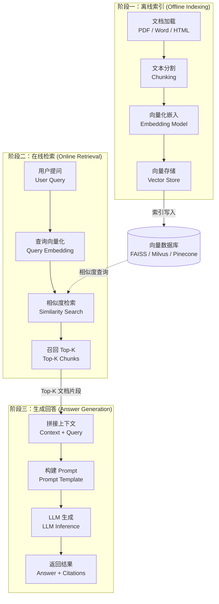
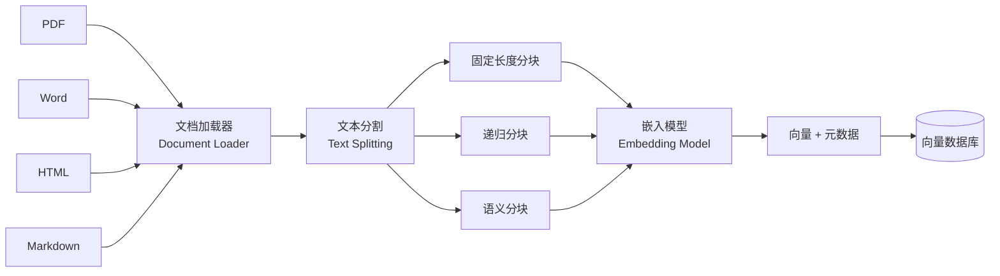
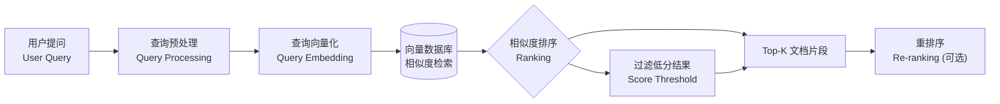
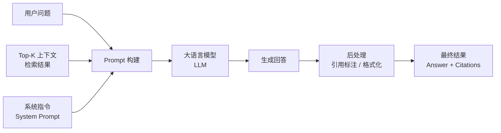

# RAG（检索增强生成）完整流程详解

## 一、概述

RAG（Retrieval-Augmented Generation，检索增强生成）是一种将**信息检索**与**大语言模型生成**相结合的技术架构。其核心思想是：在生成回答之前，先从外部知识库中检索与用户问题相关的文档片段，然后将这些片段作为上下文提供给大语言模型，从而生成更准确、更可靠的回答。

RAG 解决了纯大语言模型的三大痛点：

- **知识时效性**：模型训练数据有截止日期，无法回答最新信息
- **幻觉问题**：模型可能生成看似合理但实际错误的内容
- **领域知识缺失**：模型对特定企业 / 行业的私有知识了解有限

> **一句话理解 RAG：** 给大模型配一个"开卷考试"的资料库，让它先查资料再回答，而不是凭记忆瞎编。

---

## 二、整体架构

RAG 的完整流程分为三个阶段，向量数据库作为离线索引与在线检索之间的桥梁：



**核心数据流：**

```
原始文档 → [加载 → 分割 → 嵌入 → 存储] → 向量数据库
                                                ↕ (检索)
用户提问 → [向量化 → 检索 → 召回] → Top-K 片段 → [拼接 → Prompt → LLM → 回答]
```

---

## 三、阶段一：离线索引（Offline Indexing）

离线索引是 RAG 系统的**数据准备阶段**，在系统上线前完成（也可定期增量更新）。其目标是将原始文档转化为可高效检索的向量表示。

### 流程图



### 3.1 文档加载（Document Loading）

将不同格式的原始文档加载为统一的文本格式。

| 文档类型 | 常用工具 / 库 |
|---------|-------------|
| PDF | PyPDF2, pdfplumber, unstructured |
| Word | python-docx, unstructured |
| HTML | BeautifulSoup, lxml |
| Markdown | 直接读取 / markdown 解析器 |
| Excel / CSV | pandas, openpyxl |
| PPT | python-pptx |

**关键考量：**

- 文档解析质量直接影响后续检索效果
- 需处理表格、图片、公式等非纯文本内容
- 支持增量加载，避免全量重建索引

### 3.2 文本分割（Text Splitting / Chunking）

将长文档切分为适当大小的文本片段（Chunk），这是 RAG 系统中**最关键的环节之一**——分块质量直接决定检索精度。

| 分块策略 | 说明 | 适用场景 |
|---------|------|---------|
| 固定长度分块 | 按固定字符数 / Token 数切分 | 通用场景，简单高效 |
| 递归分块 | 按段落 → 句子 → 词逐级切分 | 保持语义完整性 |
| 语义分块 | 基于语义相似度动态切分 | 对语义连贯性要求高 |
| 文档结构分块 | 按标题 / 章节切分 | 结构化文档（法律、论文）|

**关键参数：**

- `chunk_size`：每个片段大小（通常 200 ~ 1000 tokens）
- `chunk_overlap`：相邻片段重叠区域（通常 50 ~ 200 tokens），保证上下文连续性

```
示例：chunk_size=500, chunk_overlap=100

文档: [===========片段1 (500)==========]
                [===========片段2 (500)==========]
                            [===========片段3 (500)==========]
                  ↑重叠区域↑  ↑重叠区域↑
```

### 3.3 向量化嵌入（Embedding）

将文本片段转换为高维向量（通常 768 ~ 1536 维），使语义相近的文本在向量空间中距离更近。

| 嵌入模型 | 维度 | 特点 |
|---------|------|------|
| OpenAI text-embedding-3-small | 1536 | 通用性强，效果好 |
| OpenAI text-embedding-3-large | 3072 | 高精度，成本较高 |
| BGE (BAAI) | 768 / 1024 | 开源，中英文效果好 |
| E5 (Microsoft) | 768 / 1024 | 开源，多语言 |
| Cohere embed-v3 | 1024 | 商业 API，多语言 |
| m3e (Moka) | 768 | 开源，中文优化 |

> **关键原则：** 索引阶段和检索阶段**必须使用同一个嵌入模型**，否则向量空间不一致，无法进行有意义的相似度计算。

### 3.4 向量存储（Vector Store）

将生成的向量及原始文本元信息存入向量数据库，建立索引以支持高效检索。

| 向量数据库 | 类型 | 特点 |
|-----------|------|------|
| FAISS | 本地库 | Meta 开源，高性能，适合单机 |
| Milvus | 分布式 | 开源，支持十亿级向量，云原生 |
| Pinecone | 云服务 | 全托管，开箱即用 |
| Chroma | 轻量级 | 开源，适合原型开发 |
| Weaviate | 开源 | 内置多模态支持 |
| Qdrant | 开源 | Rust 实现，高性能 |
| pgvector | PostgreSQL 扩展 | 与关系型数据库集成 |

**存储内容：**

```
每条记录 = {
    id:          "chunk_001",          // 唯一标识
    embedding:   [0.023, -0.145, ...], // 高维向量
    text:        "RAG 通过检索外部...",  // 原始文本
    metadata: {                        // 元数据
        source:   "产品手册.pdf",
        page:     3,
        section:  "概述",
        created:  "2025-01-15"
    }
}
```

---

## 四、阶段二：在线检索（Online Retrieval）

在线检索是用户提问后的**实时响应阶段**，目标是从向量数据库中快速召回与问题最相关的文档片段。

### 流程图



### 4.1 用户提问（User Query）

接收用户的自然语言问题。可在此阶段进行查询预处理：

- **查询改写**：将口语化提问改写为更规范的检索语句
- **查询扩展**：添加同义词、相关术语扩大检索范围
- **意图识别**：判断问题类型，选择不同检索策略
- **多轮对话处理**：结合历史对话补全当前问题的上下文

```
示例：
用户输入: "那个东西多少钱？"
查询改写: "iPhone 15 Pro 的价格是多少？"  (结合上下文)
查询扩展: "iPhone 15 Pro 价格 售价 多少钱 费用"
```

### 4.2 查询向量化（Query Embedding）

使用与离线索引阶段**相同的嵌入模型**，将用户问题转换为查询向量。

```
用户问题: "RAG 的优势是什么？"
    ↓ Embedding Model (与索引阶段相同)
查询向量: [0.023, -0.145, 0.891, ..., 0.034]  (768 / 1536 维)
```

### 4.3 相似度检索（Similarity Search）

在向量数据库中计算查询向量与所有文档向量的相似度，按相似度从高到低排序。

| 相似度度量 | 公式 | 特点 |
|-----------|------|------|
| 余弦相似度 (Cosine) | cos(θ) = A · B / ( \|A\| · \|B\| ) | 最常用，关注方向 |
| 欧氏距离 (L2) | d = √Σ(Aᵢ - Bᵢ)² | 关注绝对距离 |
| 点积 (Inner Product) | A · B = ΣAᵢBᵢ | 高效，需归一化 |

**检索增强技术：**

- **混合检索**：结合向量检索 + 关键词检索（BM25），兼顾语义匹配和精确匹配
- **元数据过滤**：先按元数据（时间、来源、标签）筛选，再做向量检索
- **多路召回**：多种检索策略并行，结果合并去重

### 4.4 召回 Top-K（Top-K Recall）

取相似度最高的 K 个文档片段（通常 K = 3 ~ 10），作为生成回答的上下文素材。

**后处理：**

- **分数阈值过滤**：丢弃相似度低于阈值的结果，避免引入噪声
- **去重**：移除内容重复的片段
- **重排序（Re-ranking）**：使用交叉编码器（Cross-Encoder）对 Top-K 结果精排，提升相关性

| 重排序模型 | 类型 | 特点 |
|-----------|------|------|
| Cohere Rerank | 商业 API | 效果好，即用即走 |
| BGE Reranker | 开源 | 中英文效果好 |
| bge-reranker-large | 开源 | 高精度 |

```
向量检索召回 (粗排):
  Chunk_A (score: 0.89)  ──┐
  Chunk_B (score: 0.85)  ──┤── Re-ranking ──→  Chunk_C (0.95)
  Chunk_C (score: 0.83)  ──┤   (Cross-Encoder)  Chunk_A (0.91)
  Chunk_D (score: 0.78)  ──┘                    Chunk_B (0.87)
                                                 Chunk_D (0.72)
```

---

## 五、阶段三：生成回答（Answer Generation）

将检索到的上下文与用户问题组合，输入大语言模型生成最终回答。

### 流程图



### 5.1 拼接上下文（Context Assembly）

将检索到的 Top-K 文档片段按相关度排序拼接，形成上下文语境。

```
上下文 = Chunk₁ (score: 0.95) + Chunk₂ (score: 0.91) + Chunk₃ (score: 0.87) + ...
```

**考量：**

- 上下文长度不超过 LLM 的上下文窗口限制（如 GPT-4 为 128K tokens）
- 保留每个片段的来源信息（文档名、页码）以便引用
- 可按相关度降序排列，让 LLM 优先关注最相关内容

### 5.2 构建 Prompt 模板（Prompt Template）

将系统指令、检索上下文、用户问题组合成结构化 Prompt。

**典型 Prompt 模板：**

```
你是一个专业的知识问答助手。请根据以下检索到的参考资料回答用户问题。

要求：
1. 仅基于参考资料回答，不要编造信息
2. 如果参考资料中没有相关内容，请说明"根据现有资料无法回答"
3. 在回答末尾标注信息来源

【参考资料】
[1] 来源：产品手册.pdf (第3页)
    内容：RAG 通过检索外部知识库来增强大模型的回答能力...
[2] 来源：技术白皮书.docx (第1章)
    内容：RAG 系统的核心优势包括知识时效性、可溯源性和领域适应性...

【用户问题】
RAG 的优势是什么？

【请回答】
```

### 5.3 大语言模型生成（LLM Generation）

将构建好的 Prompt 输入大语言模型，生成回答。

| 大语言模型 | 提供方 | 特点 |
|-----------|-------|------|
| GPT-4o / GPT-4 | OpenAI | 综合能力强 |
| Claude 3.5 | Anthropic | 长上下文理解优秀 |
| Qwen (通义千问) | 阿里云 | 中文理解强，开源 |
| DeepSeek | 深度求索 | 推理能力强 |
| GLM-4 | 智谱 AI | 中文场景优秀 |
| Llama 3 | Meta | 开源，可本地部署 |

**生成参数调优：**

- `temperature`：较低值（0 ~ 0.3）使回答更确定、更基于事实
- `max_tokens`：控制回答长度
- `top_p`：核采样参数，影响生成多样性

### 5.4 返回最终结果（Answer + Citations）

对 LLM 生成的回答进行后处理，返回给用户。

**后处理包括：**

- **引用标注**：将回答中的内容与来源文档片段对应，标注引用来源
- **格式化**：Markdown / 富文本格式输出
- **置信度评估**：基于检索分数和生成内容评估回答可靠性
- **流式输出**：支持逐 token 流式返回，提升用户体验

**返回示例：**

> RAG 的主要优势包括：
>
> 1. **知识时效性**：通过外部知识库获取最新信息，不受模型训练截止日期限制 [1]
> 2. **可溯源性**：回答基于检索到的具体文档，可追溯信息来源 [2]
> 3. **领域适应性**：通过更换知识库即可适配不同领域，无需重新训练模型 [1]
> 4. **降低幻觉**：基于检索事实生成回答，减少模型编造内容的概率 [2]
>
> **参考来源：**
> - [1] 产品手册.pdf, 第 3 页
> - [2] 技术白皮书.docx, 第 1 章

---

## 六、关键组件与技术选型总览

| 阶段 | 组件 | 常用技术 / 工具 |
|------|------|----------------|
| 离线索引 | 文档加载 | LangChain DocumentLoader, Unstructured |
| 离线索引 | 文本分割 | RecursiveCharacterTextSplitter, SemanticChunker |
| 离线索引 | 嵌入模型 | OpenAI Embeddings, BGE, E5, m3e |
| 离线索引 | 向量数据库 | FAISS, Milvus, Pinecone, Chroma, pgvector |
| 在线检索 | 查询处理 | 查询改写, 查询扩展, 意图识别 |
| 在线检索 | 相似度检索 | 余弦相似度, L2 距离, 混合检索 (BM25 + Vector) |
| 在线检索 | 重排序 | Cohere Rerank, BGE Reranker, Cross-Encoder |
| 生成回答 | Prompt 工程 | 模板化 Prompt, Few-shot, Chain-of-Thought |
| 生成回答 | 大语言模型 | GPT-4, Claude, Qwen, DeepSeek, GLM |
| 生成回答 | 编排框架 | LangChain, LlamaIndex, Haystack, Dify |

---

## 七、数据流向总结

```
原始文档 (PDF / Word / HTML / ...)
    │
    ▼
[文档加载] ──→ 纯文本
    │
    ▼
[文本分割] ──→ 文本片段 (Chunks)
    │              chunk_size=500, overlap=100
    ▼
[向量化嵌入] ──→ 高维向量 (768~1536 维) + 元数据
    │
    ▼
[向量存储] ──→ 向量数据库 ◄──────────────────────┐
                                              │
                                        (相似度查询)
                                              │
用户提问 ──→ [查询预处理] ──→ [查询向量化] ──────┘
                                    │
                                    ▼
                            [相似度检索] ──→ 排序 ──→ Top-K 片段
                                                        │
                                                        ▼
[拼接上下文] ◄── 用户问题 + Top-K 上下文
    │
    ▼
[构建 Prompt] ──→ 结构化 Prompt (System + Context + Query)
    │
    ▼
[LLM 生成] ──→ 回答文本
    │
    ▼
[后处理] ──→ 最终回答 + 引用来源 → 返回用户
```

---

## 八、RAG 进阶优化方向

| 优化方向 | 说明 | 效果 |
|---------|------|------|
| 混合检索 | 向量检索 + 关键词检索 (BM25) 融合 | 提升召回率，兼顾语义和精确匹配 |
| 查询改写 | LLM 辅助改写用户问题 | 提升检索精准度，适配口语化提问 |
| 重排序 (Re-ranking) | Cross-Encoder 精排 Top-K 结果 | 提升最终上下文相关性 |
| 多模态 RAG | 支持图片、表格、音频的检索与生成 | 扩展知识维度 |
| 自适应检索 | 根据问题难度动态调整检索策略 | 平衡效果与延迟 |
| GraphRAG | 结合知识图谱，增强关系推理能力 | 提升复杂推理场景表现 |
| Agentic RAG | Agent 自主决定是否检索、检索什么、如何整合 | 提升多步推理和工具调用能力 |
| Self-RAG | 模型自我评估是否需要检索及检索质量 | 减少不必要的检索，提升效率 |

---

## 九、各阶段对比总结

| 维度 | 离线索引 | 在线检索 | 生成回答 |
|------|---------|---------|---------|
| 执行时机 | 离线 / 定期 | 实时 | 实时 |
| 输入 | 原始文档 | 用户问题 | 上下文 + 问题 |
| 输出 | 向量 + 元数据 | Top-K 文档片段 | 最终回答 |
| 核心技术 | Embedding + 向量数据库 | 相似度搜索 + Re-ranking | LLM + Prompt 工程 |
| 延迟要求 | 无（离线执行） | 毫秒 ~ 秒级 | 秒级 |
| 质量影响因素 | 分块策略、嵌入模型 | 检索算法、重排序 | Prompt 设计、LLM 能力 |

---

> **文档说明：** 本文档涵盖 RAG 完整流程的三个阶段（离线索引、在线检索、生成回答），包含 Mermaid 流程图、技术选型表和数据流说明，可作为 RAG 系统设计与学习参考。
