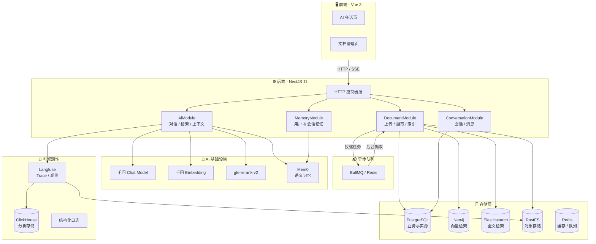
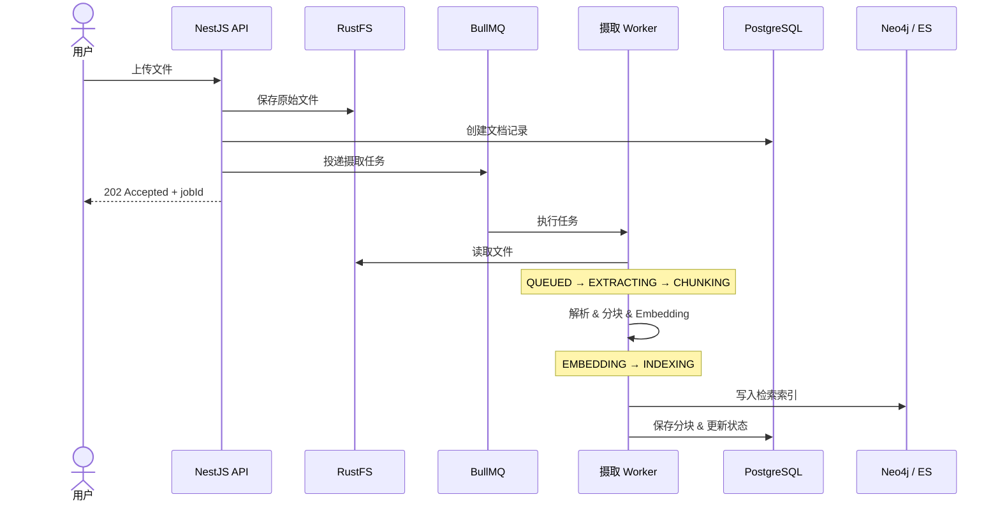
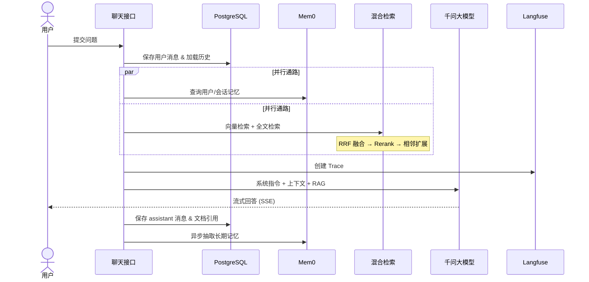
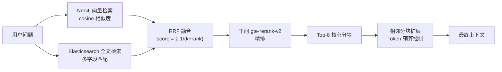

<p align="center">
  
  
  
  
  
  
  
  
  
  
</p>

<h1 align="center">Knowledge Quiz 2</h1>
<p align="center"><strong>基于 AI 的知识文档问答系统</strong> — 文档上传、智能问答、混合检索、语义记忆，一站打通 RAG 全链路。</p>

---

## 🏗️ 系统架构



---

## 🔄 核心数据链路

### 文档摄取链路

一条文档从上传到可被检索，需要跨越对象存储、关系数据库、向量库和全文索引：



### 智能问答链路

一次问答同时触发三条路径：长期记忆查询、知识检索和流式回答生成：



### 混合检索流程

检索采用 **双路召回 + 融合重排** 的四阶段管道：



---

## 🧱 技术栈

### 后端

| 分类 | 技术 | 用途 |
|------|------|------|
| 框架 | NestJS 11 + TypeScript | 模块化 DI、DTO 验证、拦截器 |
| 主数据库 | PostgreSQL 16 + TypeORM | 文档、分块、会话、消息事实源 |
| 向量检索 | Neo4j 5.26 | 余弦相似度搜索、图关系 |
| 全文检索 | Elasticsearch 8.15 | 关键词召回、多字段匹配 |
| 对象存储 | RustFS (S3 兼容) | 原始文件存储与下载 |
| 消息队列 | BullMQ + Redis 7 | 文档异步摄取、指数退避重试 |
| 缓存 | Redis 7 | 短生命周期状态、队列后端 |
| LLM 对话 | LangChain + 千问 (qwen-plus) | 流式对话生成 |
| Embedding | 千问 text-embedding-v2 | 1536 维文本向量 |
| 重排序 | 千问 gte-rerank-v2 | RAG 检索精排 |
| 长期记忆 | Mem0 | 用户记忆 & 会话语义记忆 |
| 可观测性 | Langfuse + OpenTelemetry + ClickHouse | LLM Trace、Generation 追踪 |
| 语音 | 腾讯云 ASR / TTS | 语音输入 & 语音播报 |
| 文件解析 | LangChain Loaders + LibreOffice | 14 种文件类型，含 OCR 回退 |

### 前端

| 分类 | 技术 | 用途 |
|------|------|------|
| 框架 | Vue 3 + TypeScript + Vite | Composition API、`<script setup>` |
| 流式聊天 | `@ai-sdk/vue` (Vercel AI SDK) | SSE 流式消息 |
| HTTP | Axios | REST API 请求 |
| 样式 | UnoCSS | 原子化 CSS |
| Markdown | MarkdownIt | 消息渲染 |
| 语音 | Web Speech API + SpeechSynthesis | 浏览器语音识别 & 朗读 |
| 工具 | VueUse | 组合式工具函数 |

---

## ✨ 功能特性

| 模块 | 功能 |
|------|------|
| 📄 文档管理 | 上传 (本地文件 / URL)、列表搜索、处理状态追踪、原文件下载 |
| ✂️ 智能分块 | 保留页码、标题路径、Sheet / 幻灯片等结构化元数据 |
| 🔍 混合检索 | 向量检索 + 全文检索 → RRF 融合 → 重排序 → 相邻扩展 |
| 💬 AI 对话 | 流式输出、Markdown 渲染、文档引用溯源 |
| 🧠 记忆系统 | PostgreSQL 事实源 + Mem0 用户/会话双域语义记忆 + 自动摘要压缩 |
| 🎤 语音交互 | 浏览器语音输入 (zh-CN) + TTS 语音播放 (暂停/继续) |
| 📊 可观测性 | Langfuse Trace / Generation 追踪 + ClickHouse 分析 |
| 🗂️ 多格式支持 | PDF / DOCX / PPTX / XLSX / MD / TXT / JSON / CSV / URL / 图片 / 音频 / 视频 |
| 🔄 异步摄取 | BullMQ 后台处理，支持重试、阶段追踪、失败补偿 |
| 🐳 一键部署 | Docker Compose 拉起全部基础设施，含初始化脚本 |

---

## 🚀 快速开始

### 环境要求

> 以下为本地开发的最低版本要求。

| 依赖 | 版本 | 说明 |
|------|------|------|
| Node.js | ≥ 20.x | 运行前后端 |
| pnpm | ≥ 10.x | 包管理 (workspace 模式) |
| PostgreSQL | ≥ 16.x | 业务数据库 |
| Redis | ≥ 7.x | 缓存与消息队列 |
| Docker Desktop | 最新 | 运行 Mem0、pgvector 及所有基础设施 |

### 1. 安装依赖

```bash
pnpm install
```

### 2. 配置环境变量

```bash
# 复制示例配置
cp .env.example .env
# 编辑 .env，填写 QWEN_API_KEY 等必要配置
```

### 3. 启动基础设施

一条命令拉起所有中间件：

```bash
docker compose up -d --build
```

启动后，以下服务可用：

| 服务 | 地址 | 说明 |
|------|------|------|
| Mem0 API / OpenAPI | `http://localhost:8888/docs` | 记忆服务接口 |
| Mem0 Dashboard | `http://localhost:3006` | 可视化仪表板 |
| Langfuse | `http://localhost:3005` | LLM 可观测平台 |
| pgAdmin | `http://localhost:8086` | 数据库管理 |
| RedisInsight | `http://localhost:5540` | Redis 可视化管理 |

> Mem0 Dashboard 首次打开需创建管理员账号。NestJS 通过 `MEM0_API_KEY` 调用 Mem0；生产环境必须显式设置 `MEM0_API_KEY`、`MEM0_JWT_SECRET` 和 `MEM0_POSTGRES_PASSWORD`。

### 4. 启动后端

```bash
cd backend
pnpm run start:dev
```

### 5. 启动前端

```bash
cd frontend
pnpm run dev
```

---

## 📁 项目结构

```
knowledge-quiz2/
├── backend/                       # NestJS 后端
│   └── src/
│       ├── ai/                    # 对话、检索、上下文管理
│       ├── conversations/         # 会话与消息持久化
│       ├── documents/             # 文档上传、摄取、索引
│       ├── memory/                # Mem0 长期记忆抽象层
│       ├── infrastructure/        # 基础设施集成
│       │   ├── elasticsearch/     #   全文检索
│       │   ├── file-processor/    #   多格式文件解析
│       │   ├── langfuse/          #   LLM 可观测性
│       │   ├── mem0/              #   记忆 HTTP 客户端
│       │   ├── neo4j/             #   图数据库 & 向量搜索
│       │   ├── redis/             #   缓存 & 队列连接
│       │   ├── rustfs/            #   S3 对象存储
│       │   └── speech/            #   语音识别 & 合成
│       ├── entities/              # TypeORM 实体定义
│       ├── migrations/            # 数据库迁移文件
│       ├── common/                # 日志、过滤器、拦截器
│       └── config/                # 配置管理
├── frontend/                      # Vue 3 前端
│   └── src/
│       ├── pages/                 # AiConversationPage / BackendManagementPage
│       ├── components/            # 会话 & 文档组件
│       │   ├── conversation/      #   ConversationList / MessageList / ChatInput
│       │   └── document/          #   DocumentList / FileUpload / ChunkList
│       ├── composables/           # useConversation / useDocument / useSpeechSynthesis
│       ├── core/                  # Axios HTTP 封装
│       └── types/                 # 全局 TS 类型
├── docker/                        # Docker 配置
│   ├── mem0/                      #   Mem0 镜像构建
│   ├── initdb/                    #   数据库初始化 SQL
│   └── clickhouse/                #   ClickHouse 配置
├── docker-compose.yml             # 基础设施编排
├── docker-compose.prod.yml        # 生产环境编排
├── pnpm-workspace.yaml            # pnpm 工作区
└── scripts/                       # 数据库重置等工具脚本
```

---

## 🏷️ 开发规范

| 规范项 | 约定 |
|--------|------|
| 代码风格 | ESLint + Prettier |
| TypeScript | 严格模式 (`strict: true`) |
| 命名规范 | `camelCase` 变量/函数 · `PascalCase` 组件/类 · `kebab-case` 文件名 |
| 注释规范 | JSDoc 标准 |
| 版本管理 | Commitlint (Conventional Commits) + Husky |
| 模块组织 | NestJS Module → Controller → Service 分层，Composable-driven 前端 |
| 数据一致性 | 多存储写入收口到一致性服务，失败执行补偿清理 |

---

## 📊 数据存储职责矩阵

明确每个组件的"事实源"与"不应承担"的职责，避免数据漂移：

| 组件 | 主要职责 | 不应承担的职责 |
|------|----------|----------------|
| PostgreSQL | 文档、分块、会话、消息的**唯一事实源** | 向量近邻搜索 |
| Neo4j | 文档分块向量 & 可扩展图关系 | 会话历史事实源 |
| Elasticsearch | 分块全文检索 & 关键词召回 | 单独决定最终相关性 |
| RustFS | 原始上传文件 & 可下载对象 | 保存业务查询关系 |
| Redis | BullMQ 队列 & 短生命周期缓存 | 聊天上下文的唯一来源 |
| Mem0 | 跨会话用户记忆 & 会话语义记忆 | 替代完整聊天记录 |
| Langfuse | LLM Trace & 性能观测 | 参与业务事务 |
| ClickHouse | Langfuse 分析数据存储 | 直接承载业务查询 |

---

## 🔗 相关资源

- [技术复盘文章](./技术文章-AI共建知识库复盘.md) — 项目演进实录与 AI 协作方法总结
- [掘金发布稿](./文章-掘金发布.md) — 对外技术分享文章
- [文件转换学习 Demo](./file-conversion-demos/) — 独立可运行的文件处理示例集
