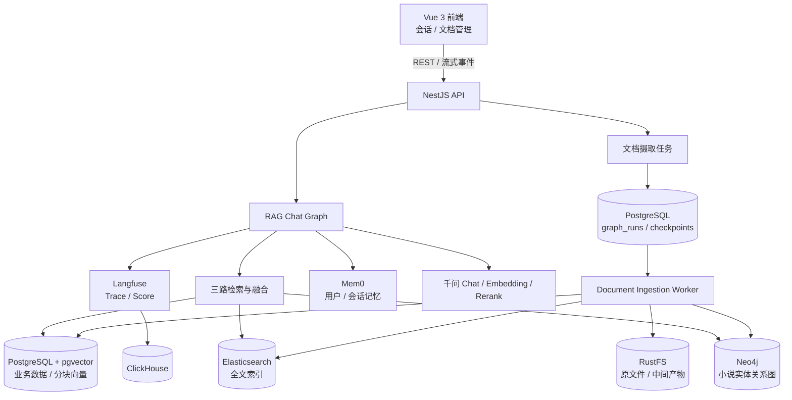
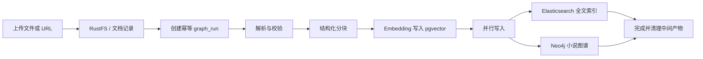
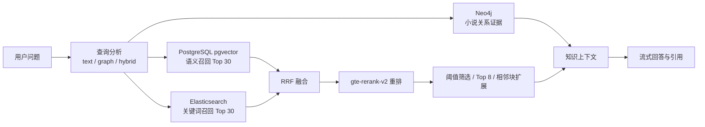

<p align="center">
  
  
  
  
  
  
  
</p>

<h1 align="center">Knowledge Quiz 2</h1>
<p align="center"><strong>面向知识文档与小说内容的 AI 问答系统</strong></p>
<p align="center">多格式摄取、可恢复工作流、文本与图谱混合检索、流式回答、语义记忆和全链路观测。</p>

## 当前架构



存储职责已经明确拆分：

| 组件 | 当前职责 |
|---|---|
| PostgreSQL | 文档、分块、会话、消息、运行状态的事实源；pgvector 向量检索；LangGraph checkpoint |
| Elasticsearch | 分块关键词与全文召回 |
| Neo4j | 小说、章节、人物、地点、组织、事件及其关系，不再保存分块向量 |
| RustFS | 上传原文件与摄取中间产物 |
| Mem0 | 跨会话用户记忆与会话语义记忆 |
| Redis | 通用缓存及 Mem0/Langfuse 等基础设施依赖 |
| Langfuse + ClickHouse | LLM 调用链路、Generation 与质量评分观测 |

## 文档摄取

上传接口立即返回 `202 Accepted` 和任务 ID，耗时处理由 LangGraph Worker 完成。任务元数据、租约与重试状态保存在 PostgreSQL，而不是进程内队列。



摄取链路具备：

- 内容哈希 + parser 版本幂等键，避免重复任务。
- PostgreSQL `FOR UPDATE SKIP LOCKED` 任务领取、租约、心跳和指数退避重试。
- PostgreSQL LangGraph checkpoint，进程重启后可以续跑。
- 解析、分块、Embedding、图谱、索引等阶段进度查询。
- 失败补偿清理；小说图谱失败会单独记录，不影响已成功的文本索引。
- PDF、Office、表格、演示文稿、文本、图片、音视频与 URL 的结构化提取。

支持扩展名：`.pdf`、`.doc`、`.docx`、`.xls`、`.xlsx`、`.csv`、`.ppt`、`.pptx`、`.txt`、`.md`、`.json`、`.jpg`、`.jpeg`、`.png`、`.gif`、`.webp`、`.mp3`、`.wav`、`.m4a`、`.mp4`。单文件上限 50 MiB。

## 混合检索与回答

系统先用模型判断问题属于 `text`、`graph` 或 `hybrid`，再按需并行调用三条检索通路：



向量或关键词分支单独故障时会自动降级；小说图谱证据通过原始分块 ID 回接引用。最终提示词还会合并 PostgreSQL 会话历史和 Mem0 双域记忆，并在回答后保存消息、引用和新记忆。

## 技术栈

| 分类 | 技术 |
|---|---|
| 后端 | NestJS 11、TypeScript、TypeORM |
| 工作流 | LangGraph、PostgreSQL Checkpointer |
| 主数据库与向量 | PostgreSQL 16、pgvector、HNSW cosine index |
| 全文与图谱 | Elasticsearch 8.15、Neo4j 5.26 |
| 模型 | 千问 `qwen-plus`、`text-embedding-v2`、`gte-rerank-v2`、视觉模型 |
| 对象存储 | RustFS（S3 兼容） |
| 记忆 | Mem0（用户域 + 会话域） |
| 可观测性 | Langfuse 3、OpenTelemetry、ClickHouse |
| 文件处理 | LangChain loaders、OfficeParser、LibreOffice、FFmpeg、Sharp、腾讯云 ASR/TTS |
| 前端 | Vue 3、Vite、TypeScript、Pinia、UnoCSS、AI SDK、Axios、MarkdownIt |

## 快速开始

### 环境要求

- Node.js 20 或更高版本
- pnpm 10
- Docker Desktop
- 可用的千问 API Key
- 处理旧版 Office 或音视频时，本机需要 LibreOffice / FFmpeg，或在环境变量中指定其路径

### 1. 安装依赖

```powershell
pnpm install
```

### 2. 配置环境变量

```powershell
Copy-Item .env.example .env
```

至少填写 `QWEN_API_KEY`。同时确认前后端端口一致：示例文件中的后端端口是 `3001`，因此本地通常应设置：

```dotenv
BACKEND_PORT=3001
VITE_API_BASE_URL=http://localhost:3001
```

不要把真实 `.env` 提交到仓库。

### 3. 启动基础设施

```powershell
pnpm docker:up
```

常用本地入口：

| 服务 | 地址 |
|---|---|
| PostgreSQL | `localhost:5432` |
| RedisInsight | `http://localhost:5540` |
| Elasticsearch | `http://localhost:9200` |
| Kibana | `http://localhost:5601` |
| Neo4j Browser | `http://localhost:7474` |
| RustFS Console | `http://localhost:9005` |
| Mem0 API | `http://localhost:8888/docs` |
| Mem0 Dashboard | `http://localhost:3006` |
| Langfuse | `http://localhost:3005` |
| pgAdmin | `http://localhost:8086` |

### 4. 启动后端

```powershell
Set-Location backend
pnpm run start:dev
```

开发模式默认在 API 进程内自动启动摄取 Worker。要拆分运行，设置 `INGESTION_WORKER_AUTOSTART=false`，并在另一个终端执行：

```powershell
Set-Location backend
pnpm run start:ingestion-worker
```

### 5. 启动前端

```powershell
Set-Location frontend
pnpm run dev
```

前端默认由 Vite 提供在 `http://localhost:5173`。

## API 概览

后端统一使用 `/api` 前缀。

| 方法与路径 | 说明 |
|---|---|
| `POST /api/documents` | 上传文件或 URL，返回 `documentId` 与 `jobId` |
| `GET /api/documents` | 分页、按名称查询文档 |
| `GET /api/documents/:id` | 文档与分块详情 |
| `GET /api/documents/:id/ingestion` | 摄取进度、重试与图谱状态 |
| `GET /api/documents/:id/download` | 下载原文件 |
| `DELETE /api/documents/:id` | 删除文档及关联数据 |
| `GET /api/chunks?documentId=...` | 查询文档分块 |
| `PUT /api/chunks/:id` | 更新分块内容并同步索引 |
| `GET /api/conversations` | 查询会话 |
| `POST /api/conversations/chat` | 发起流式 RAG 对话 |

## 项目结构

```text
knowledge-quiz2/
|-- backend/
|   `-- src/
|       |-- ai/                     # 检索图、对话图、模型与上下文
|       |-- conversations/          # 会话和消息
|       |-- documents/              # 上传、摄取图、Worker、小说图谱抽取
|       |-- graph/                  # 任务租约与 LangGraph checkpoint
|       |-- infrastructure/
|       |   |-- postgres-vector/    # pgvector 查询与索引校验
|       |   |-- elasticsearch/      # 全文索引
|       |   |-- neo4j/              # 小说实体关系图
|       |   |-- rustfs/             # 对象存储
|       |   |-- mem0/               # 语义记忆
|       |   `-- langfuse/           # 可观测性
|       |-- entities/
|       |-- migrations/
|       `-- cli/
|-- frontend/
|   `-- src/
|       |-- pages/
|       |-- components/
|       |-- composables/
|       `-- core/
|-- docker/
|-- docs/
|-- scripts/
|-- docker-compose.yml
|-- docker-compose.prod.yml
`-- pnpm-workspace.yaml
```

## 运维与一致性检查

以下命令在 `backend/` 目录执行：

```powershell
pnpm run rag:check
pnpm run rag:reindex
pnpm run rag:reindex-one -- <documentId>
pnpm run rag:graph-rebuild
pnpm run rag:graph-rebuild-one -- <documentId>
pnpm run rag:cleanup-legacy-neo4j
```

- `rag:check` 检查 PostgreSQL 分块、pgvector 向量、HNSW 索引、Elasticsearch 数量，以及图谱就绪文档的 Neo4j 节点。
- `rag:reindex*` 重新进入完整摄取流程，会产生模型调用成本。
- `rag:graph-rebuild*` 只重建小说图谱。
- `rag:cleanup-legacy-neo4j` 删除旧版 Neo4j 分块节点和向量索引。应先完成 pgvector 重建并通过 `rag:check`，再执行此不可逆清理。

已有数据库从旧版升级时必须使用支持 pgvector 的 PostgreSQL 镜像并执行迁移。`1784200000000-NovelHybridRag.ts` 会启用 `vector` 扩展、把 `chunks.embedding` 转为 `vector(1536)` 并创建 HNSW 索引。

## 开发与验证

```powershell
# 后端
Set-Location backend
pnpm run typecheck
pnpm run test
pnpm run build

# 前端
Set-Location frontend
pnpm run lint:check
pnpm run format:check
pnpm run build
```

根目录 `pnpm lint` 以及两个包的 `lint` 脚本会使用 `--fix` 修改文件；只想检查时优先运行前端的 `lint:check` 或针对后端使用不带 `--fix` 的 ESLint 命令。

## 相关文档

- [后端文件上传与 RAG 回复技术文档](./docs/后端文件上传与RAG回复技术文档.md)
- [RAG 完整流程详解](./RAG完整流程详解.md)
- [项目 RAG 实现技术文档](./项目RAG实现技术文档.md)
- [项目技术复盘](./技术文章-AI共建知识库复盘.md)
- [掘金发布稿](./文章-掘金发布.md)
