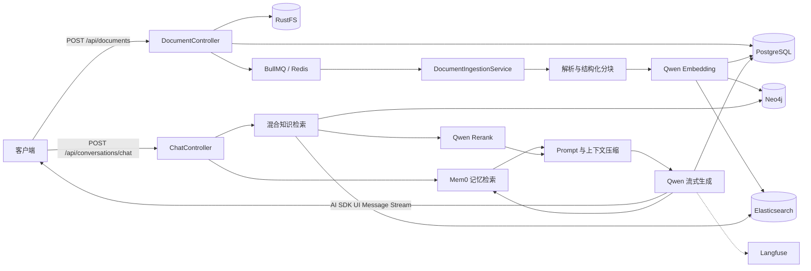
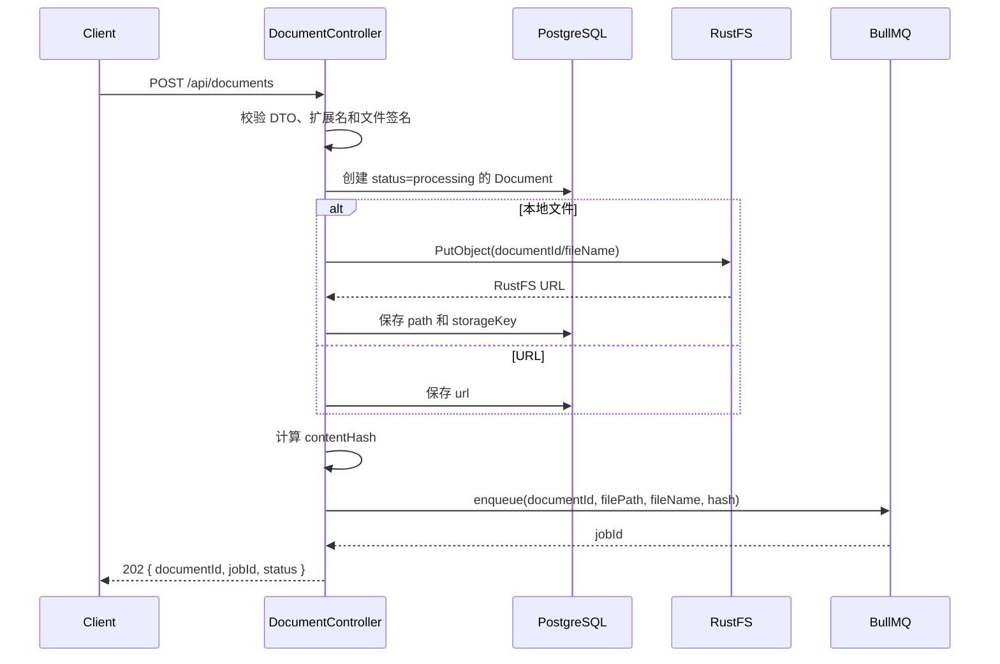
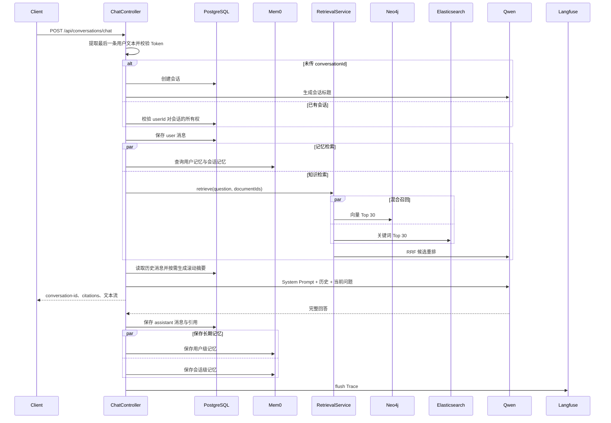

# 我用 AI 做了一个知识库问答系统，但真正困难的不是写代码

> 这是一次个人项目复盘，也是一份 AI 编程的工程实录。我在当前项目继续开发时，围绕 Vue 3、NestJS、PostgreSQL、Neo4j、Elasticsearch、Redis、RustFS、Mem0 和 Langfuse 处理了一连串真实问题。AI 写了大量代码，但真正消耗精力的部分，是不断追问：数据真的写进去了吗？不同存储一致吗？服务重启以后还成立吗？模型回答的依据可追踪吗？

## 1. 效果演示

### 页面预览


默认的首页，可以从这里发起会话


查看已经上传的文档


可以把个人知识资料上传进来


可以查看切片效果如何，实际上都是看的数据库

### 查看有资料和没资料的区别


这里我把九渊秘境的小说从知识库里删掉了，可以看到他查不出来⬆️


这里可以看到已经解锁到了，回答的很准确⬆️


可以通过 langfuse 去查看对应的提示词信息，这里没有做多 agent 和 tools，这些做了也会看到。


也能够通过 mem0 看到对应的长期记忆


## 2. 为什么会有 Knowledge Quiz

我做这个项目，不是因为市场上缺少一个知识库产品，也不是准备立刻把它包装成商业化 SaaS。更直接的原因是，我想用一个足够完整的个人项目，把 RAG、流式对话、文档处理、记忆系统和大模型真正串起来。

网上介绍 RAG 的文章很多。最小示例通常只有几步：读取文件、切分文本、生成 Embedding、向量检索，再把结果拼进 Prompt。这条链路很适合解释概念，但离一个能够持续使用的系统还有很远。

只要往前走一步，问题就会迅速变多：

- 上传文件的种类繁多，链路复杂，如何有效的跟 rustfs, postgrel, es, neo4j 做最佳处理
- RAG 找到的片段到底来自哪一份文档，用户能不能下载原文核对？
- langfuse 跟 langSmith 的区别，对于真实的问题是否能够解决？
- 在真实的情况下 mem0 的记忆如何维护，存在哪些边界？

这些问题放在一起，才是我真正想练习的内容。

当前项目的产品边界并不复杂。它是个人实战项目，所以目前没有引入登录、租户、角色和复杂权限。

但实际技术栈一点也不小：NestJS、Vue 3、LangChain、Vercel AI SDK、PostgreSQL、Redis、RustFS、Elasticsearch、Neo4j、Mem0、Langfuse、ClickHouse，再用 Docker Compose 统一拉起。

现在回头看，这份清单既是一张学习路线，也是一颗复杂度炸弹。每多引入一个组件，就多一份配置、多一个故障面，也多一种数据一致性问题。不过这正是个人项目的价值：可以主动把问题放大，再从中理解每个组件的真实边界。

我还想额外验证一件事：AI 能不能真正参与一个中等复杂度的全栈项目，而不只是生成几个孤立函数。

答案是可以，几乎 100% 的代码都是 ai 生成的，但有一个非常重要的前提：**AI 可以承担大量的编码工作，却不能替开发者定义什么叫“做完”，什么叫做“可用”。**

## 3. 我是怎样把当前项目一步步跑通的

第一天，我用 ai 生成了整个项目的初始架构，然后就开始了不断的修修改改的旅程

第X天，`POST /api/documents` 在写入 Neo4j 时失败。错误明确指出，节点属性不能保存嵌套 Map。修完这个问题后，我又发现文档列表里的 `chunkCount` 已经是 2，`GET /api/chunks` 却一条数据也查不到：向量数据写进去了 neo4j，PostgreSQL 的分块表却没有同步落库。

第x+1天，聊天接口又把 assistant 消息保存成了 `[object AsyncGenerator]`。页面上的流式输出和数据库里的最终消息并不是同一件事，日志装饰器在包装异步生成器时改变了返回语义。

这些问题决定了当前项目的演进方式：ai 帮我加快了整个流程的开发，但是我还是需要去主动排查问题，一次次把断开的数据链路接起来。

随后几天的会话记录基本沿着这条路线推进：

1. 修复 RustFS 中文文件名经过 multipart、URL 编码和对象 Key 后不一致的问题。
2. 把自定义聊天 GET/SSE 协议改成 Vercel AI SDK 默认的 POST UI Message Stream。
3. 让会话标题、历史消息和 Langfuse Trace 真正工作。
4. 给语音播放增加暂停与继续，并排查 Langfuse 没有上报的问题。
5. 把 Langfuse 的对象存储统一到 RustFS，补齐文档引用和原文件下载。
6. 分析 Redis Key 来源，将业务 Redis 与 Langfuse 使用不同逻辑 DB 隔离。
7. 审查整个项目的数据一致性、生产部署、性能、日志和模块边界。
8. 将同步文档处理改成 BullMQ 后台摄取，并补齐迁移、校验和失败补偿。
9. 分析不同文件类型的 RAG 流程，处理扫描 PDF、向量索引和记忆系统问题。

这条历史比“AI 一次生成了整个系统”更有价值。它说明 AI 编程在真实项目里更常见的形态，是围绕日志、接口和运行状态持续迭代。

项目的核心问题也逐渐从“这个功能能不能调用”变成了“整条链路是否真的闭合”。

例如，一次文档上传只有同时满足下面这些条件，才算真正完成：

- 原始文件已经进入对象存储；
- PostgreSQL 中存在文档记录和状态；
- 后台任务能够读取文件并完成解析；
- 分块保留了页码、标题路径、Sheet、幻灯片等来源信息；
- Embedding 已经生成；
- PostgreSQL、Neo4j 和 Elasticsearch 中的数据相互对应；
- 失败时能够看到失败阶段，并清理部分写入的数据；
- 前端能查询处理进度，而不是让一次 HTTP 请求一直等待。

这套验收标准不是 AI 第一次生成代码时自动给出的，而是在多次真实运行、报错和返工以后逐渐形成的。

>你可能会说这不是提示词没给完整么，你说的是有道理的。实际上我开过好几次项目来不断完善我的初始提示词但是最终模式都会发展成跟上面类似的样子，ai 会加速开发，但是整个项目的稳定可靠运行还是需要程序员不断的调整才会变得靠谱，你可以一行代码不写，但是你还是需要读 ai 生成的大量代码

## 4. 重点功能详解

### 4.1 数据与基础设施详解

各组件目前的职责如下：

| 组件 | 主要职责 | 不应该承担的职责 |
| --- | --- | --- |
| PostgreSQL | 文档、分块、会话、原始消息、摘要等业务事实 | 不承担向量近邻搜索 |
| RustFS | 原始上传文件、可下载对象 | 不保存业务查询关系 |
| Neo4j | 文档分块向量和可扩展的图关系 | 不作为会话历史事实源 |
| Elasticsearch | 分块全文检索与关键词召回 | 不单独决定最终相关性 |
| Redis | BullMQ 队列、缓存及其他短生命周期状态 | 不再作为聊天上下文的唯一来源 |
| Mem0 | 跨会话用户记忆和会话语义记忆 | 不代替完整聊天记录 |
| Langfuse | LLM Trace、Generation、会话和性能观测 | 不参与业务事务 |
| ClickHouse | Langfuse 的分析数据 | 不直接承载本项目业务查询 |

### 4.2 上传与回答

> 上传与回答这俩个流程是本项目的核心功能了，一个涉及文档的切片一个设计 ai 的准确性，这俩功能针对不同的业务场景是有不同的处理手段，有相当的经验门槛，这里就重点讲一下

整体代码流程



####  4.2.1 上传链路详解


这里的难点是
1. 多种文件类型的处理分支特别多，像我写这篇文章的时候我也仅仅是验证了 md 和 pdf 俩个文件类型，而 pdf 就分为文字型和图片型的其他的我还没有尝试，但我在看代码的过程中还看到 doc 和 docx 都是两种不同的版本还专门处理了一下
2. 优化空间也特别大，例如 neo4j,postgres,es 都能做向量检索，然后他们又有自己独立的功能，另外还有专门的向量库都是分别有不同的处理场景，这块细扣也能提升不少
3. 不同文件类型的 splitter 也有讲究，包括我后面想到的问题上传的xx.md 文件有多少个标题，给予目前主流的rag方案实际上解决不了这个问题，因为 rag 更多的是查找相似的资料，而不是解决这种结构性问题。这里可以用 neo4j 来创建图谱也可以用 tools 来提供技能

目前的版本只能说是初步实现了能用的，距离好用的企业级目标还是有距离的


### 4.2.2 ai 回答链路详解

这里是主流的 rag 解法，通过 postgres 的向量匹配 + es 的关键词匹配做混合检索，并且在这个基础上还优化了扩展附近片段来保证语义完整性，然后使用 RFF 算法进行合并在使用 REMARK 做语义理解排序给 ai prompt 提供有效的上下文。这里额外提一下虽然是主流解法但是针对不同的

这里我还额外做了 mem0 长期记忆和会话摘要功能。对于这个系统来说我觉得是有些多余的，但是对于理解 ai 流程来说我觉得是必要的因此也加上了

## 5. 我如何跟 AI 协作

>如果只说“这个项目使用 AI 编程完成”，信息量其实很低。AI 在不同阶段扮演的角色完全不同，接下来我给你娓娓道来。

### 5.1 让 ai 思考方案，我来优化

这个项目我后来思考了一下似乎可以这么做, 但实际上大差不差：
1. 告诉 AI 我要做一个个人知识库项目，然后选择计划方案，ai 咔咔就能来个上千字的文档，然后我纠偏。大方向上没问题我的主要框架就有了，这么做看似也合理但我给的提示词实际上更加大而全我把我的架构图直接输给了 ai经过验证实际上只要对 spec.md 文件进行仔细阅读纠偏实际上是一样的。
2. 通读 AI 代码，确认技术细节有无遗漏，是否合理。有些偏差，不看源码根本体会不到，比如：
    -   文件上传原本在一个接口里处理，从上传到文档切片、向量化，整个过程 loading 时间过长。
    -   langfuse 依赖 postgres 和 redis，但我镜像里已有这两个容器，它却又额外创建了新容器。
    -   明明有现成的文档切片库，它却自行实现了一套新的。

>总结一下：AI 基于概率判断，比如让它写前端，用 React 概率高于 Vue，写脚本 Python 概率高于 Node 。但企业真实业务场景不能依赖概率，AI 技术方案需专门调整，不是简单实现个人 AI 问答知识库，而是要提供大量企业场景判断**

### 5.2 方案没问题，有 bug 直接丢日志给 AI

**我读代码的目的已转向确认方案有没有出入和学习思路与掌握细节；至于Bug，通常交给AI看日志即可。这其实也构成了新的测试闭环——不仅发现问题，更参与解决问题。**

后续协作更多是围绕具体证据展开。我会把接口、错误堆栈、数据库现象或 Docker 输出直接交给 AI，例如：

- 文档列表显示 `chunkCount = 2`，分块接口却查不到数据；
- Neo4j 拒绝写入嵌套 Map 属性；
- assistant 内容被保存为 `[object AsyncGenerator]`；
- Langfuse 页面没有 Trace；
- PostgreSQL 被判定 unhealthy；
- `document_embeddings_v2` 向量索引不存在；
- Redis 中出现很多看不懂的 Key；
- 页面刷新后历史消息和记忆不完整。

具体日志会显著提高 AI 的定位质量。与其说“上传坏了”，不如提供请求、错误、预期结果和相关数据状态。AI 可以顺着调用链查 controller、service、entity、Compose 和前端 composable，再给出跨文件修改。

### 5.3 让 AI 反过来审查整个项目

当功能基本跑通后，我让 AI 从三个角度重新审查：不合理的结构、性能问题、扩展性问题。这次审查发现了很多“单个接口能跑，但系统长期会坏”的问题：

- 编辑或删除 Chunk 只更新 PostgreSQL，没有同步 Neo4j；
- 生产 Dockerfile、端口和前端 API 地址不一致；
- 生产环境关闭 `synchronize`，却缺少可靠 migration；
- 上传接口串行执行整个摄取流程，容易超时和产生内存峰值；
- 多存储写入失败后没有补偿；
- Neo4j 所谓批处理仍是一条 Chunk 一次网络请求；
- 日志可能输出 SQL 参数和消息正文；
- 前后端状态枚举与字段类型已经出现漂移。

这类代码审查是 AI 很有价值的用法。它不需要重新理解每个文件，可以在全仓库搜索后同时比较多条数据链路。但审查意见也不能照单全收，仍要按风险和项目规模选择实施顺序。

## 6. AI 到底给这个项目提了多少效率

我不准备给出“效率提升 10 倍”之类的数字，因为这个项目没有建立人工对照组，也没有统一计算需求分析、等待 Docker、模型 Token 成本和返工时间。

但有几类效率提升是非常明确的。

### 6.1 横向修改的速度

会话记忆 V2 同时修改实体、migration、service、controller、Mem0 适配层、前端 composable、消息列表和类型定义。传统手工开发最容易漏掉的是契约同步：后端新增分页游标，前端类型忘记更新；实体增加字段，migration 漏掉索引；删除会话时，Mem0 会话记忆没有一起清理。

AI 能快速搜索所有消费者，再批量完成这些机械但要求上下文一致的工作。

### 6.2 从错误堆栈回溯调用链

当 Neo4j、Langfuse 或 BullMQ 报错时，问题往往跨越 Compose、环境变量、初始化代码和业务 service。AI 可以快速检索变量名、端口、索引名和调用位置，减少人工在几十个文件间跳转的时间。

### 6.3 补测试和执行回归

AI 不只生成测试模板，也能根据修复目标增加针对性用例，例如：

- 异步生成器仍能被消费；
- Neo4j metadata 被转成基础属性；
- 缺失向量索引时自动创建并重试；
- 编辑 Chunk 会重新计算并同步检索内容；
- 中文文件名经过 RustFS 上传下载仍保持正确；
- 视频处理缺少 FFmpeg 时明确失败，而不是索引占位文本。

更重要的是，它可以持续运行构建、测试、Lint、Compose 校验和接口探测，再根据错误继续修复。一次集中整改后，项目达到了 15 个后端测试套件、137 个测试通过；另一次基础设施改造也完成了数据库重置、Docker 重启、Langfuse、后端 API 和前端构建的联合验证。

## 7. 我形成的一套 AI 协作方法

经过这个项目，我现在更倾向于用下面的方式与 AI 协作。

### 7.1 大任务先分析，再实现

对于记忆系统、检索链路和多存储一致性，我会先让 AI 阅读当前代码并给出方案。方案要说明事实源、数据流、失败策略、兼容性和验收条件。确认以后再实施。

这样做不是为了增加一份形式化文档，而是避免 AI 在写到一半时才替我决定关键语义。

### 7.2 用证据描述 Bug

一个有效的故障任务通常包含：

```text
操作：调用 POST /api/conversations/chat
现象：Neo4j 报 document_embeddings_v2 不存在
预期：数据库重置后应用仍能自动恢复检索能力
约束：不能只在本地手工建索引，需要补测试并验证项目启动
```

接口、日志、数据状态和验收标准越具体，AI 越不容易只修表面症状。

## 8. 收获

这个项目最大的收获，不只是学会了怎样把 NestJS、Vue 3、Neo4j、Elasticsearch、Mem0 和 Langfuse 连接起来。

更重要的是，我开始理解 AI 编程改变了工程工作的哪一部分。

过去，一个个人开发者很难在短时间内同时维护前端、后端、数据库迁移、消息流、向量检索、对象存储、Docker Compose、日志和上百个测试。AI 把大量实现和检索成本降了下来，让一个人能够触及过去需要多人协作的工作量。

但代码越容易产生，“什么才算做完，怎样才算合适的方案”就越重要。

一个 controller 存在，不代表请求链路成立；一个容器 Healthy，不代表业务完成初始化；一组测试通过，不代表它验证了真实风险；一个 RAG 回答语气确定，不代表引用足以支持结论；一篇技术文章结构完整，也不代表描述与代码一致。

AI 最擅长的是把明确的问题迅速展开成实现，并在反馈循环里持续修正。开发者最重要的工作，则是定义问题、识别假完成、决定取舍、提供真实证据，并对最终结果负责。

## 结语：AI 时代我们更应该掌握什么

我是一个多年开发的 web 前端工程师，拥有丰富的手写代码经验。像我的学习路径是很系统了学习了 html,js,css,vue 等等，读过的书也很多例如红宝石，犀牛书，忍者书，蝴蝶书，vue 架构原理，包括框架代码我也读了不少，例如 webpack，vue，axios。

因为这个时候的面试其实更看重深度，在我实际的工作中这种深度带来的优势有但很少会用到，但我其实也是乐此不疲的往深处攀登，因为这能提高我的内力

但是 ai 时代我觉得还用这套学习流程就不合理了，ai 之前一个人能做的事情很少，很慢，我觉得好的编程方式是非常重要的，例如大型管理系统每一次做都会提高组件封装的质量，因为在这个过程中你在不断的打怪升级，思考出来了越来越多更合理的设计方案，因此多年的经验是有价值的，尤其是头三年时间编码能力的提升是无与伦比的快的

然而 ai 之后一个人能做的事情很多，这个多一方面是涉及更多个领域，另一方面是同样的东西效率提高了很多倍。像这个 ai 问答系统涉及的东西太多了，redis，postgres，es，neo4j，mem0, langfuse 等等。把他们系统的学一遍需要很久，灵活运用需要很久，掌握最佳范式需要很久，但现在 ai 就能够给出一个中等偏上的代码，而我们更多的是思考为什么用 postgres 而不是用 mysql，为什么用 mongodb 而不是用 mysql。因为迁移的成本在变低底层架构的运营在提高。之前是我会 node 不会 python，在这个项目上用 python 会更有优势一些，但是我对于 node 特别熟悉，因此我用 node 会写的更快他就把 python 的优势给打平了。现在 ai 来写这个代码我们更多的是把代码抽象成通用的伪代码
