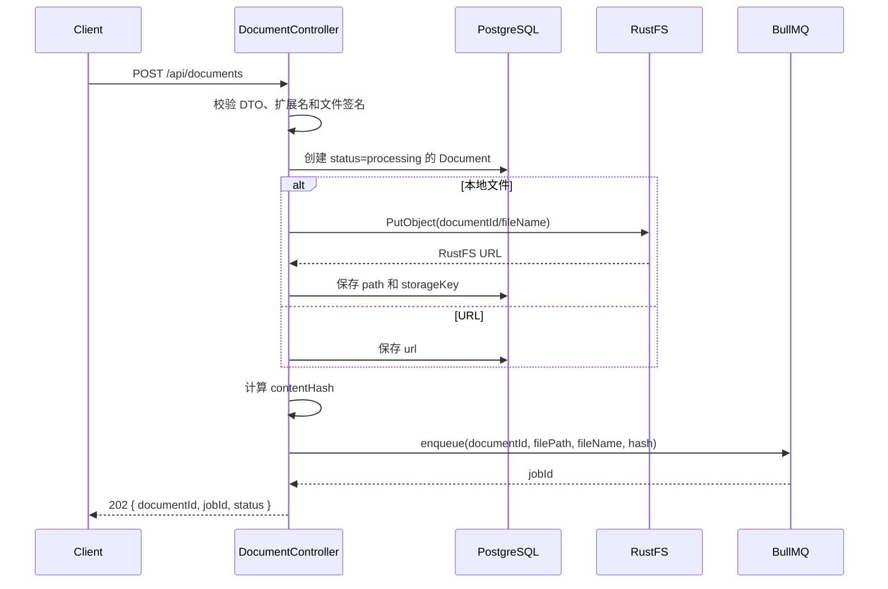
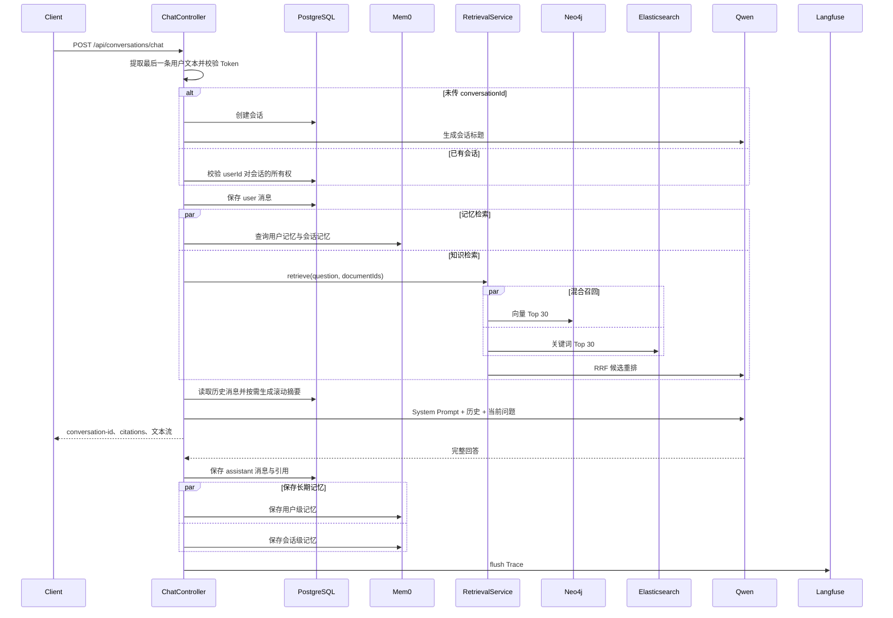

   # 我用 AI 做了一个 AI 知识库问答系统，但真正困难的不是写代码

> 这是一次个人项目复盘，也是一份 AI 编程的复杂工程实录。我在当前项目继续开发时，围绕 Vue3、NestJS、PostgreSQL、Neo4j、Elasticsearch、Redis、RustFS、Mem0 和 Langfuse 处理了一连串真实问题。AI 写了大量代码，但真正消耗精力的部分，是不断追问：数据真的写进去了吗？不同存储一致吗？服务重启以后还成立吗？模型回答的依据可追踪吗等等，也是我对 AI 协作的一次思考和对使用 AI 编程工作流的一次梳理

## 1. 效果演示

### 1.1 页面预览

默认的首页，可以从这里发起会话

查看已经上传的文档

可以把个人知识资料上传进来

可以查看切片效果如何，实际上都是看的数据库

### 1.2 有无资料的回答对比

这里我把九渊秘境的小说从知识库里删掉了，可以看到他查不出来⬆️

这里可以看到已经解锁到了，回答的很准确⬆️

可以通过 langfuse 去查看对应的提示词信息，这里没有做多 agent 和 tools，这些做了也会看到。

也能够通过 mem0 看到对应的长期记忆

## 2. 如何借助 AI 不手写代码，把整个项目跑通

### 2.1 实现项目的对话流程

一开始，我用计划模式帮我生成个人AI知识库问答系统，ai 就会有一个 spec.md 让我看看是否执行，这里我重点是看技术选型，功能是否符合我预期，像提到的登录，注册，账号权限我觉得都没必要。这个时候 ai 生成了整个项目的初始架构，然后我开始读代码看看有没有哪些地方跑偏了。虽然 spec.md 能达到上千字看着特别详细，但是落地到这个项目里上千字也是不够详细的。例如
- md文档切片这里他自己实现了，但是有开源的 MarkdownTextSplitter 可以使用，我就需要让他修改。
- nestjs 的项目他的目录结构不是最佳规范我引入了 nestjs-best-practices skill 来约束重新生成了代码结构，类似的技能还有 vue-best-practices，eslint-prettier-config, javascript-typescript-jest。这些技能都可以去网站https://skills.sh/ 搜索到
- langfuse 他可以直接配合 langchain 直接自主跟踪，但是他写了整个过程

还有就是文档里面写了的，但是实际上他跑偏了。例如：
- 切片入库这里 neo4j 有向量生成，但是 postgres 却没有，但是实体类里面有这个字段。也属于 bug，严重的是 es 他压根就漏掉了
- 还有记忆存储这里我提到了要有 mem0 他也没处理
- 我提到了使用 vercel sdk 的格式来处理流式 ai 回复他也没有用到

我花费了一定的时间让整个架构不跑偏，接下来就是各种各样的 bug 了：

1. `POST /api/documents` 在写入 Neo4j 时失败。错误明确指出，节点属性不能保存嵌套 Map。修完这个问题后，我又发现文档列表里的 `chunkCount` 已经是 2，`GET /api/chunks` 却一条数据也查不到：向量数据写进去了 neo4j，PostgreSQL 的分块表却没有同步落库。
2. 聊天接口把 assistant 消息保存成了 `[object AsyncGenerator]`。页面上的流式输出和数据库里的最终消息并不是同一件事，日志装饰器在包装异步生成器时改变了返回语义。

这些问题决定了当前项目的演进方式：ai 帮我加快了整个流程的开发，但是我还是需要去主动排查问题，一次次把断开的数据链路接起来。

随后几天的会话记录基本沿着这条路线推进：

1. 修复 RustFS 中文文件名经过 multipart、URL 编码和对象 Key 后不一致的问题。
2. 把自定义聊天 GET/SSE 协议改成 Vercel AI SDK 默认的 POST UI Message Stream。
3. 让会话标题、历史消息和 Langfuse Trace 真正工作。
4. 给语音播放增加暂停与继续，并排查 Langfuse 没有上报的问题。
5. 把 Langfuse 的对象存储统一到 RustFS，补齐文档引用和原文件下载。
6. 分析 Redis Key 来源，将业务 Redis 与 Langfuse 使用不同逻辑 DB 隔离。
7. 审查整个项目的数据一致性、生产部署、性能、日志和模块边界。
8. 将同步文档处理改成 BullMQ 后台摄取，并补齐迁移、校验和失败补偿。
9. 分析不同文件类型的 RAG 流程，处理扫描 PDF、向量索引和记忆系统问题。

这些历史比“AI 一次生成了整个系统”更有价值。它证明 AI 编程在真实项目里更常见的形态，是围绕日志、接口和运行状态持续迭代。

例如，一次文档上传只有同时满足下面这些条件，才算真正完成：

- 原始文件已经进入对象存储；
- PostgreSQL 中存在文档记录和状态；
- 后台任务能够读取文件并完成解析；
- 分块保留了页码、标题路径、Sheet、幻灯片等来源信息；
- Embedding 已经生成；
- PostgreSQL、Neo4j 和 Elasticsearch 中的数据相互对应；
- 失败时能够看到失败阶段，并清理部分写入的数据；
- 前端能查询处理进度，而不是让一次 HTTP 请求一直等待。

这套验收标准不是 AI 第一次生成代码时自动给出的，而是在多次真实运行、报错和返工以后逐渐形成的。

这里也不否认更高级的大模型会把这个处理时间变短很多，我一开始用的 trae cn 出现问题我需要读代码定位到特别清晰的 prompt 才能解决问题，换了 codex 之后就成了给日志和部分信息即可解决

### 2.2 AI 使用技巧梳理

1. **让 AI 思考方案，我来优化**：像我一开始先出 spec.md 文档就是这个流程，虽然我脑海里对于这个项目的接口有多少，数据库如何设计，上传流程，rag 设计都有一定的想法，但是要写出来这一步还是十分耗费时间的。所以让 AI 生成这个会给我节约不少时间而且我也可以查看 AI 的设计方案有没有更合理的地方，属于互相弥补

2. **根据会话记录让 AI 总结重复失败的东西整理成 skill**： 对应项目里面的就是 project-permission-guard 这个 skill，我当时给 AI 的权限是替我审批，然后我每次都会阅读 AI 的思考，他总是会重复使用 volta 的 node 执行代码，然后没有权限思考如何越过这个问题白白浪费很多 token。有了这个 skill 指导就好了很多。

3. **AI 解决问题的时候总是遗漏的内容整理成 skill**：这里举几个例子：
    
    3.1 每次新增代码日志不符合预期
    
    3.2 每次有代码修改不确保测试用例是否完整，已有测试用例是否无问题

    3.3 确保项目能够正常启动，而不是每次修改完了项目启动都报错，需要解决一个 bug 然后他又引入了其他的 bug
    3.4 每次的代码都能够过一下 lint

    我把这些整理成了 code-log-check 之后有代码的改动 Agent 就会调用这个 skill 确保有符合我需要的 log，覆盖率足够高的测试用例，确保项目打包启动无问题。使得我的开发效率成倍提高
    
4. **遇到 bug 给予合适的提示信息**： 不要说上传文件的时候报错了，帮我修复一下。而是把 log 日志的 error 给到 Agent，有堆栈信息他就能够根据堆栈信息快速定位问题，没有堆栈信息的情况实际上你的问题也会更加具体，这种就可以分情况看看要不要帮 AI 锁定某个文件的某个方法

5. **让 AI 自动检查项目是否有 bug，是否有需要优化的地方**：问这种问题一般是项目写的差不多了会用到这个技巧。这里 AI 会找出来一些防御的边界情况，也会给出一些新的设计方案，这种方案上就需要根据业务场景来考虑了，没有明显的对错。对于发散思维非常的有好处

## 3. 重点技术功能详解

### 3.1 数据与基础设施详解

各组件目前的职责如下：

| 组件 | 主要职责 | 不应该承担的职责 |
| --- | --- | --- |
| PostgreSQL | 文档、分块、会话、原始消息、摘要等业务事实 | 不承担向量近邻搜索 |
| RustFS | 原始上传文件、可下载对象 | 不保存业务查询关系 |
| Neo4j | 文档分块向量和可扩展的图关系 | 不作为会话历史事实源 |
| Elasticsearch | 分块全文检索与关键词召回 | 不单独决定最终相关性 |
| Redis | BullMQ 队列、缓存及其他短生命周期状态 | 不再作为聊天上下文的唯一来源 |
| Mem0 | 跨会话用户记忆和会话语义记忆 | 不代替完整聊天记录 |
| Langfuse | LLM Trace、Generation、会话和性能观测 | 不参与业务事务 |
| ClickHouse | Langfuse 的分析数据 | 不直接承载本项目业务查询 |

### 3.2 上传与问答

> 上传与回答这俩个流程是本项目的核心功能了，一个涉及文档的切片一个设计 ai 的准确性，这俩功能针对不同的业务场景是有不同的处理手段，有相当的经验门槛，这里就重点讲一下

整体代码流程

```mermaid
flowchart LR
    Client[&#34;客户端&#34;] -->|&#34;POST /api/documents&#34;| Upload[&#34;DocumentController&#34;]
    Upload --> PG[(&#34;PostgreSQL&#34;)]
    Upload --> RustFS[(&#34;RustFS&#34;)]
    Upload --> Queue[&#34;BullMQ / Redis&#34;]
    Queue --> Worker[&#34;DocumentIngestionService&#34;]
    Worker --> Parse[&#34;解析与结构化分块&#34;]
    Parse --> Embed[&#34;Qwen Embedding&#34;]
    Embed --> PG
    Embed --> Neo4j[(&#34;Neo4j&#34;)]
    Embed --> ES[(&#34;Elasticsearch&#34;)]

    Client -->|&#34;POST /api/conversations/chat&#34;| Chat[&#34;ChatController&#34;]
    Chat --> Memory[&#34;Mem0 记忆检索&#34;]
    Chat --> Retrieval[&#34;混合知识检索&#34;]
    Retrieval --> Neo4j
    Retrieval --> ES
    Retrieval --> Rerank[&#34;Qwen Rerank&#34;]
    Memory --> Prompt[&#34;Prompt 与上下文压缩&#34;]
    Rerank --> Prompt
    Prompt --> LLM[&#34;Qwen 流式生成&#34;]
    LLM -->|&#34;AI SDK UI Message Stream&#34;| Client
    LLM --> PG
    LLM --> Memory
    LLM -.-> Langfuse[&#34;Langfuse&#34;]
```

####  3.2.1 上传链路详解

这里的难点是
1. 多种文件类型的处理分支特别多，像我写这篇文章的时候我也仅仅是验证了 md 和 pdf 俩个文件类型，而 pdf 就分为文字型和图片型的其他的我还没有尝试，但我在看代码的过程中还看到 doc 和 docx 都是两种不同的版本ai还专门处理了一下
2. 优化空间也特别大，例如 neo4j,postgres,es 都能做向量检索，然后他们又有自己独立的功能，另外还有专门的向量库都是分别有不同的处理场景，这块细扣也能提升不少
3. 不同文件类型的 splitter 也有讲究，包括我后面想到的问题上传的xx.md 文件有多少个标题，给予目前主流的rag方案实际上解决不了这个问题，因为 rag 更多的是查找相似的资料，而不是解决这种结构性问题。这里可以用 neo4j 来创建图谱也可以用 tools 来提供技能

目前的版本只能说是初步实现了能用的，距离好用的企业级目标还是有距离的

### 3.2.2 AI 问答链路详解

这里是主流的 rag 解法，通过 postgres 的向量匹配, es 的关键词匹配来做混合检索，并且在这个基础上还优化了扩展附近片段来保证语义完整性，然后使用 RFF 算法进行合并在使用 REMARK 做语义理解排序给 ai prompt 提供有效的上下文。这里额外提一下虽然是主流解法但是针对不同的业务类型还是存在不少影响比较大的微调的。比如你询问 xx.md 有多少个标题，像常规的 rag 他只是返回片段是处理不了这种问题的

## 8. 总结

1. 我刚系统的学习了 Agent 相关的知识，但只是理论层面。这个项目让我把理论付诸于实践，实现了具体的业务实现。让理论灵活运用了起来，也得到了满满的成就感

2. 对于 AI 的使用越发娴熟，实际上我使用 AI 已经很久了，但是看到一些文章说 AI 独自跑多久多久实现一个数据库，AI 怎么怎么厉害是存疑的，这个项目相当于我对 AI 祛魅的一个过程和对 AI 协作有了更深刻的理解。

    2.1 第一阶段我在 23, 24 年的时候(忘记具体是啥时候了)就已经 AI 编程了，当时用的是 cursor ，那个时候对中文不是很友好，大模型解决问题的能力也偏弱就跟小孩子的玩具一样，基本上体验了一下就放弃了
    
    2.2 到后面 24 年底 25 年初左右。 AI 编程越演越烈，我又进行了尝试这个时候我已经离不开 CUE(就是写代码的时候会给你预测写什么然后 TAB 使用这段代码) 了，但是对话解决问题实现需求还是不行。
    
    2.3 再到 25 年底，26 年初。AI 相比起之前对我最有用的两件事情就是新需求喂给他 figma 设计稿和产品需求在这个基础上再打磨细节，另外一件就是很多的功能型函数脚本都让 AI 实现。往往是跟 AI 对话完了我就可以接杯水，上个厕所休息一下等等结果。效率得到了很大的提升
    
    2.4 到现在 26 年中旬用 AI 从 0-1 搭建出来的这个项目。

    深刻体验到了原有的编码方式和现有的编码方式发生了翻天覆地的变化。
    
## 交流沟通

如果你想跟我跟更多的人讨论 AI 相关的知识欢迎加我入群沟通, 记得备注 **AI交流** 让我知道你的来意

