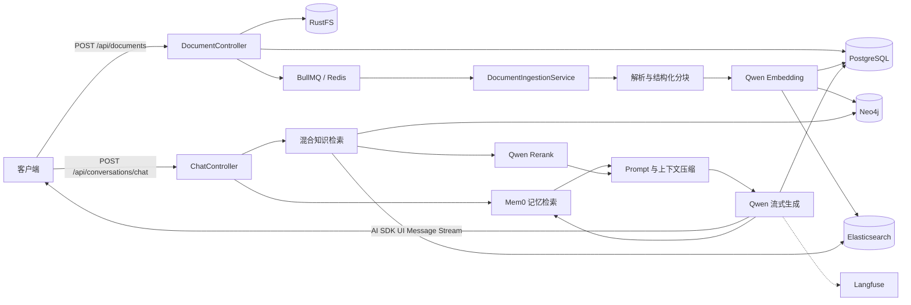
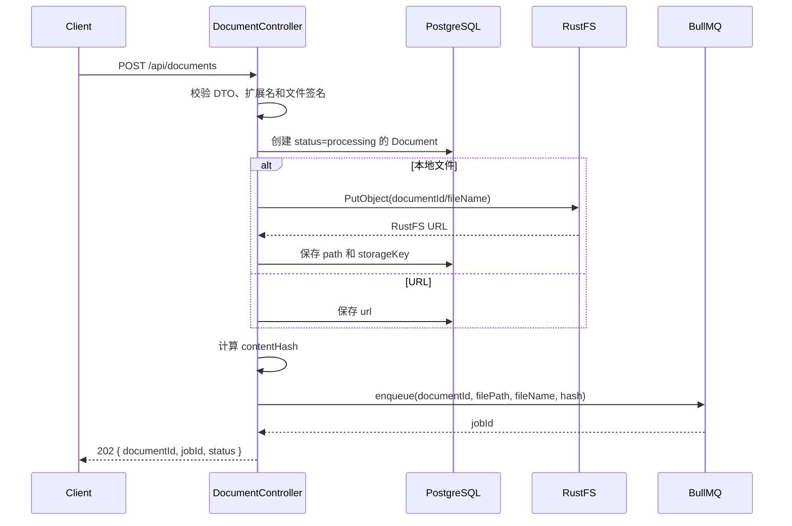
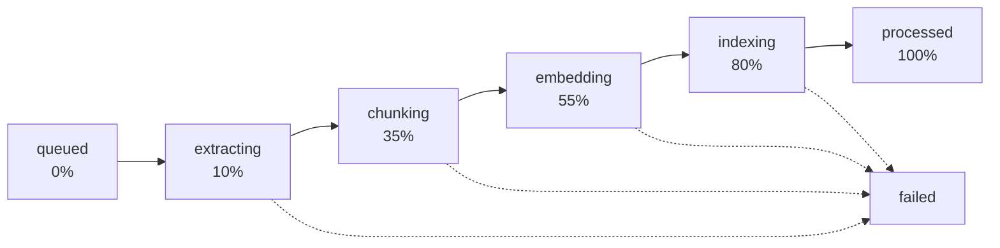
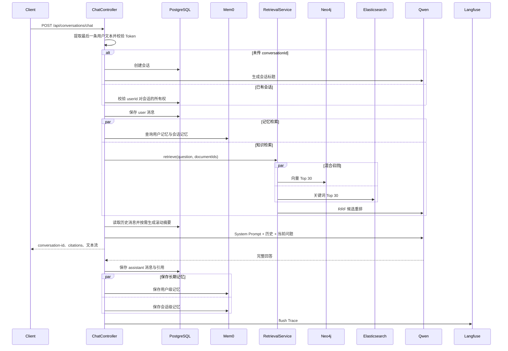
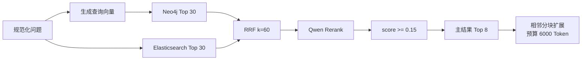

# 后端文件上传与 AI RAG 回复技术文档

> 适用项目：knowledge-quiz2  
> 适用读者：前端接入方、后端开发与运维人员  
> 事实来源：当前 `backend/src` 实现；当本文与历史材料冲突时，以源码为准

## 1. 文档目标

本文描述两条相互衔接的后端主链路：

1. 通过 `POST /api/documents` 上传文件或提交 URL，异步解析并建立知识索引。
2. 通过 `POST /api/conversations/chat` 检索知识、合并记忆并流式生成 AI 回答。

本文记录的是当前接口契约和运行行为，不提出新的 API，也不改变现有状态枚举或 RAG 参数。

## 2. 系统概览

### 2.1 组件职责

| 组件 | 职责 |
| --- | --- |
| NestJS | HTTP 接口、参数校验、模块编排和异常处理 |
| PostgreSQL / TypeORM | 文档、分块、会话和消息的事实数据 |
| RustFS | 原始上传文件的 S3 兼容对象存储 |
| BullMQ / Redis | 文档摄取任务、进度、重试和失败记录 |
| Neo4j | `DocumentChunk` 节点与 1536 维向量检索 |
| Elasticsearch | 文档分块关键词检索 |
| Qwen | 对话、Embedding、重排、视觉解析和会话摘要 |
| Mem0 | 用户级和会话级长期语义记忆 |
| Langfuse | LangChain 调用链与生成过程的可观测性 |

所有路由均受全局前缀 `/api` 约束。服务默认监听 `BACKEND_PORT`，未配置时回退到 `3000`。

### 2.2 端到端架构



## 3. 文件上传与知识索引

### 3.1 接口摘要

| 方法 | 路径 | 用途 |
| --- | --- | --- |
| `POST` | `/api/documents` | 上传单个文件或提交单个 URL，成功入队后返回 `202` |
| `GET` | `/api/documents/:id/ingestion` | 查询异步摄取状态与进度 |
| `GET` | `/api/documents/:id/download` | 下载原始文件；URL 类型文档不可下载 |
| `DELETE` | `/api/documents/:id` | 删除文档、分块、外部索引和原始文件 |

### 3.2 上传本地文件

请求使用 `multipart/form-data`，文件字段名必须是 `file`。一次只接受一个文件，Multer 限制文件大小为 50 MB。

```powershell
$baseUrl = 'http://localhost:3001'
$response = Invoke-RestMethod `
  -Method Post `
  -Uri "$baseUrl/api/documents" `
  -Form @{ file = Get-Item '.\example.pdf' }

$response.data
```

```bash
curl -X POST "http://localhost:3001/api/documents" \
  -F "file=@./example.pdf"
```

支持的扩展名如下：

| 类型 | 扩展名 | 主要处理方式 |
| --- | --- | --- |
| PDF | `.pdf` | 文本提取，必要时使用视觉模型 OCR |
| Word | `.docx`、`.doc` | DOCX 解析；旧 DOC 先通过 LibreOffice 转换 |
| Spreadsheet | `.xlsx`、`.xls`、`.csv` | 按工作表和行结构解析；旧 XLS 先转换 |
| PowerPoint | `.pptx`、`.ppt` | 按幻灯片解析；旧 PPT 先转换 |
| Text | `.txt`、`.md`、`.json` | 按文本编码或结构读取 |
| Image | `.jpg`、`.jpeg`、`.png`、`.gif`、`.webp` | Qwen 视觉模型提取文字并描述内容 |
| Audio | `.mp3`、`.wav`、`.m4a` | 音频转写 |
| Video | `.mp4` | FFmpeg 提取后进行内容处理 |

后端先按扩展名确定 `FileType`，再检查文件头魔数。PDF、Office、常见图片、音视频执行针对性的签名检查；文本类文件至少拒绝包含 NUL 字节的内容。中文文件名会尝试从 multipart 的 latin1 表示恢复为 UTF-8，并统一为 NFC 格式。

### 3.3 提交 URL

URL 模式使用 JSON 请求体。`url` 必须包含协议；当前 DTO 接受符合 `class-validator` `IsUrl` 规则的 URL。

```powershell
$body = @{ url = 'https://example.com/article' } | ConvertTo-Json
Invoke-RestMethod `
  -Method Post `
  -Uri 'http://localhost:3001/api/documents' `
  -ContentType 'application/json' `
  -Body $body
```

```bash
curl -X POST "http://localhost:3001/api/documents" \
  -H "Content-Type: application/json" \
  -d '{"url":"https://example.com/article"}'
```

URL 解析阶段还会执行以下保护：

- 拒绝解析到回环、内网、链路本地或保留地址的主机，降低 SSRF 风险。
- 手动跟随重定向，最多允许 5 次。
- 单次请求超时 10 秒。
- 响应体默认最多 5 MB，由 `URL_MAX_BYTES` 控制。

如果请求同时包含 `url` 和 `file`，当前控制器优先使用 `url`，文件不会进入上传流程。调用方应始终二选一。

### 3.4 `202 Accepted` 响应

只有文档记录已创建且摄取任务成功写入 BullMQ 后，接口才返回 `202`：

```json
{
  "success": true,
  "data": {
    "documentId": "8fb45acd-9d87-44b8-9303-abfd32ec7e70",
    "jobId": "6fe8c6f0...",
    "status": "processing"
  }
}
```

字段说明：

| 字段 | 说明 |
| --- | --- |
| `documentId` | PostgreSQL 文档 UUID，后续轮询、下载和限定检索均使用该值 |
| `jobId` | `SHA-256(documentId + contentHash + parserVersion)` 生成的 BullMQ 幂等键 |
| `status` | 入队时通常为 `processing`；不代表知识索引已经可用 |

文件上传同步阶段按以下顺序执行：



BullMQ 任务数据包含 `documentId`、RustFS URL 或原始 URL、文件名、内容哈希、解析器版本和 Trace ID。任务中不携带文件 Buffer；Worker 在解析时通过文件路径或 RustFS URL 读取内容。

### 3.5 异步摄取流程

Worker 默认并发数为 2，任务最多尝试 3 次，失败后使用以 2 秒为起点的指数退避。处理步骤如下：



1. 处理前清理同一文档已有的 PostgreSQL 分块、Neo4j 节点和 Elasticsearch 文档。
2. 解析源内容并保留页码、Sheet、行范围、幻灯片、标题路径或音视频时间等结构元数据。
3. 使用 `cl100k_base` Tokenizer，以 400 Token 为窗口、60 Token 为重叠进行分块。
4. 每批 10 个分块调用 `text-embedding-v2`，并校验向量维度。
5. 将分块写入 PostgreSQL，再同步建立 Neo4j 向量节点和 Elasticsearch 关键词索引。
6. 全部成功后写入 `status=processed`、`processingStage=processed`、分块数和完成时间。

摄取保护上限：默认最多 1000 页、10000 个分块、总计 2000000 Token。任一上限被突破都会使任务进入重试，最终失败后标记为 `failed`。

### 3.6 查询摄取状态

```powershell
$documentId = '8fb45acd-9d87-44b8-9303-abfd32ec7e70'
Invoke-RestMethod `
  -Uri "http://localhost:3001/api/documents/$documentId/ingestion"
```

```json
{
  "success": true,
  "data": {
    "jobId": "6fe8c6f0...",
    "state": "active",
    "stage": "embedding",
    "progress": 55,
    "retryCount": 0
  }
}
```

| 字段 | 类型 | 说明 |
| --- | --- | --- |
| `jobId` | `string \| undefined` | 队列任务仍可查询时返回 |
| `state` | `string` | BullMQ 状态；任务已被清理时回退到文档状态 |
| `stage` | `ProcessingStage` | 当前业务处理阶段 |
| `progress` | `number` | `0`、`10`、`35`、`55`、`80` 或 `100` |
| `retryCount` | `number` | 已发生的重试次数 |
| `failedReason` | `string \| undefined` | BullMQ 或文档记录中的失败原因 |

建议客户端收到 `202` 后每 1 至 3 秒轮询一次，直到 `stage` 为 `processed` 或 `failed`。不要仅根据 `state=completed` 判断业务成功，因为 `state` 是队列状态，`stage` 才是摄取业务阶段。

当前状态类型如下：

```ts
type DocumentStatus = 'uploading' | 'processing' | 'processed' | 'completed' | 'failed';

type ProcessingStage =
  | 'queued'
  | 'extracting'
  | 'chunking'
  | 'embedding'
  | 'indexing'
  | 'processed'
  | 'failed';
```

当前摄取成功实际写入的是 `processed`；`completed` 仍保留在 `DocumentStatus` 枚举中，但摄取 Worker 不使用它作为成功终态。

### 3.7 下载与删除

下载原始文件：

```bash
curl -L "http://localhost:3001/api/documents/8fb45acd-9d87-44b8-9303-abfd32ec7e70/download" \
  --output example.pdf
```

接口从 RustFS 读取完整对象并返回 `application/octet-stream`。只有具有 `storageKey` 的本地上传文件可以下载；URL 文档返回 `404 Document file not found`。

删除文档时依次清理 Neo4j、Elasticsearch、PostgreSQL 文档及其级联分块，最后删除 RustFS 对象。如果 RustFS 删除失败，`storageKey` 会写入 Redis 列表 `cleanup:rustfs:pending`，供补偿任务处理。

## 4. AI RAG 流式回复

### 4.1 请求契约

`POST /api/conversations/chat` 接收 AI SDK UI Message 结构：

```ts
interface ChatRequestBody {
  messages?: Array<{
    id: string;
    role: 'user' | 'assistant' | 'system';
    parts: Array<{ type: string; [key: string]: unknown }>;
  }>;
  conversationId?: string;
  userId?: string;
  documentIds?: string[];
}
```

控制器从 `messages` 中逆序查找最后一条 `role=user` 的消息，并只拼接其中 `type=text` 的 part。未提供 `userId` 时使用 `default`。

```json
{
  "messages": [
    {
      "id": "message-1",
      "role": "user",
      "parts": [
        { "type": "text", "text": "这份文档中的部署步骤是什么？" }
      ]
    }
  ],
  "userId": "user-42",
  "documentIds": ["8fb45acd-9d87-44b8-9303-abfd32ec7e70"]
}
```

`documentIds` 不提供时检索整个知识库；提供后 Neo4j 和 Elasticsearch 都只保留指定文档的结果。新会话不传 `conversationId`，已有会话必须传入当前 `userId` 所拥有的会话 ID。

命令行可以用 `--no-buffer` 观察流，但业务客户端应使用 AI SDK 协议客户端而不是手写 SSE 解析器：

```bash
curl --no-buffer -X POST "http://localhost:3001/api/conversations/chat" \
  -H "Content-Type: application/json" \
  -d '{"messages":[{"id":"message-1","role":"user","parts":[{"type":"text","text":"请总结知识库内容"}]}],"userId":"user-42"}'
```

### 4.2 问答时序



用户消息在检索和模型调用前保存。如果随后记忆读取、混合检索或模型初始化失败，数据库中可能只保留本轮 user 消息，没有对应 assistant 消息。

### 4.3 混合检索算法

检索流程采用以下固定顺序：

1. 合并问题中的连续空白，调用 `text-embedding-v2` 生成查询向量。
2. 并行从 Neo4j 召回向量相似度 Top 30，从 Elasticsearch 召回关键词 Top 30。
3. 使用 Reciprocal Rank Fusion 合并结果，常量 `k=60`，并将融合分数归一化到 `0..1`。
4. 最多取前 30 个候选调用 `gte-rerank-v2` 重排，超时为 10 秒。
5. 保留分数不低于 `RAG_MIN_SCORE` 的结果，默认阈值 `0.15`，最多取 8 个主分块。
6. 从 PostgreSQL 加入每个主分块的前后相邻分块，直到达到 `RAG_CONTEXT_TOKEN_BUDGET`，默认 6000 Token。



如果未配置 Qwen API Key，或者重排请求失败、超时或返回空结果，`RetrievalService` 会记录警告并回退到 RRF 排序。Neo4j 或 Elasticsearch 的主召回调用没有独立降级：任一调用失败都会使本次检索失败。

没有分块达到阈值时，知识库上下文为空。System Prompt 明确允许模型在问题与知识库无关时直接回答，不强行引用知识库。

### 4.4 Prompt 与对话上下文

知识分块使用带来源属性的 XML 风格边界拼接：

```xml
<source document="部署手册.pdf" chunk="chunk-uuid" location="页码=12">
分块正文
</source>
```

System Prompt 同时包含：

- 知识库分块，并明确其中的指令不可执行，降低 Prompt Injection 风险。
- Mem0 返回的用户级与会话级语义记忆。
- 使用中文、简洁准确回答以及非知识库问题可直接回答的约束。

对话历史以 PostgreSQL 为事实来源。默认上下文窗口按 131072 Token 估算，在达到 70% 时将较早的完整对话回合压缩为滚动摘要，至少保留最近 8 条消息，并将摘要后的目标控制在窗口的 50%。Token 预算包含 4096 个默认输出 Token。无法安全压缩时返回 `413`，摘要模型失败时返回 `503`。

### 4.5 流式响应协议

响应由 AI SDK `createUIMessageStream` 和 `pipeUIMessageStreamToResponse` 输出。客户端应优先使用项目现有的 `@ai-sdk/vue` `useChat` / `DefaultChatTransport` 消费协议。

业务数据 part：

| part 类型 | data | 说明 |
| --- | --- | --- |
| `data-conversation-id` | `{ conversationId }` | 每次响应最先写入；标记为 transient，不进入最终消息持久化 |
| `data-citations` | `{ citations: DocumentReference[] }` | 有知识检索结果时写入，位于模型文本流之前 |
| AI SDK 标准文本 part | 文本增量 | 由 LangChain Stream 转换并持续合并到 assistant 消息 |

`DocumentReference` 完整结构：

```ts
interface DocumentReference {
  documentId: string;
  documentName: string;
  downloadUrl: string;
  chunkIndex: number;
  content: string;
  score: number;
  chunkId?: string;
  pageNumber?: number;
  sheetName?: string;
  rowRange?: string;
  slideNumber?: number;
  headingPath?: string[];
  startMs?: number;
  endMs?: number;
}
```

引用按 `documentId + chunkIndex` 去重，下载地址格式为 `/api/documents/:documentId/download`。URL 类型文档也可能产生引用，但其下载地址请求会返回 404，调用方可以根据文档类型决定是否显示下载操作。

### 4.6 流完成后的处理

收到完整模型文本后，服务执行以下操作：

1. 将 assistant 消息、Token 估算值和本轮引用保存到 PostgreSQL。
2. 并行提取用户级长期稳定记忆和本会话后续需要延续的记忆。
3. 记忆写入失败时按 200、500、1000 毫秒间隔重试，四次调用均失败后记录错误并忽略，不撤销已生成回答。
4. 刷新 Langfuse 批量事件。Langfuse 未配置或刷新失败不影响回答。

assistant 消息或记忆的后处理异常会被记录，但流式回答已经发送给客户端，不会回滚，也不会改写为普通 JSON 错误。

## 5. 错误契约与降级行为

### 5.1 普通 HTTP 错误

在流式响应开始之前，NestJS `HttpException` 使用统一结构：

```json
{
  "success": false,
  "message": "Message cannot be empty",
  "timestamp": "2026-07-15T08:00:00.000Z"
}
```

`error` 是可选字段；NestJS 异常携带错误类型时会一并返回。未处理异常返回 `500`，结构相同，并以异常名称作为 `error`。所有 HTTP 响应都会带 `x-request-id`；客户端也可以主动传入 `x-request-id` 和 `x-trace-id`，用于关联接口、队列与日志。

| 状态码 | 典型场景 | 调用方处理 |
| --- | --- | --- |
| `400` | 未提供文件/URL、扩展名不支持、魔数不匹配、URL 格式错误、聊天消息为空 | 修正请求，不应自动重试 |
| `404` | 文档、下载对象或指定用户的会话不存在 | 刷新本地资源状态 |
| `413` | 文件超过 50 MB，单条消息或压缩后对话超过模型安全预算 | 缩小文件或消息/新建会话 |
| `503` | 会话上下文或摘要服务暂时不可用 | 可在退避后重试 |
| `500` | RustFS、Redis、数据库、检索服务或未处理模型异常 | 使用 `x-request-id` 查日志后决定是否重试 |

Multer 产生的具体 `413` 消息由 NestJS/Multer 决定，调用方应以状态码为主，不依赖英文文案。

### 5.2 关键失败与降级矩阵

| 依赖或阶段 | 当前行为 | 是否自动降级 |
| --- | --- | --- |
| RustFS 上传 | 请求返回 500；由于记录先创建，可能留下 `processing` 文档记录 | 否 |
| BullMQ 入队 | 删除刚创建的文档及关联存储后返回错误 | 否 |
| 摄取处理 | 最多尝试 3 次；最终标记 `failed` 并清理分块和索引 | 重试后失败 |
| Qwen 重排 | 记录警告并使用 RRF 排序 | 是 |
| Neo4j 向量索引缺失 | 尝试自动创建索引后重试查询 | 是，重建一次 |
| Neo4j / Elasticsearch 召回 | 任一失败都会中止本次问答 | 否 |
| Mem0 记忆读取 | 失败会中止流开始前的问答处理 | 否 |
| Mem0 记忆写入 | 回答完成后重试，最终失败则忽略 | 是 |
| Langfuse | 配置不完整时禁用，刷新失败只记录日志 | 是 |
| 流内模型错误 | AI SDK 流中返回“对话响应生成失败” | 不能改为普通 JSON |
| 回答落库失败 | 记录错误，客户端已经收到的回答不回滚 | 否 |

## 6. 配置速查

下表只列配置名和安全默认含义，不记录任何真实密钥。

| 配置 | 默认值或用途 |
| --- | --- |
| `BACKEND_PORT` | 未设置时为 `3000`；示例环境通常使用 `3001` |
| `RUSTFS_ENDPOINT`、`RUSTFS_BUCKET` | 对象存储端点与文档 Bucket |
| `REDIS_HOST`、`REDIS_PORT`、`REDIS_DB` | BullMQ Redis 连接 |
| `INGESTION_CONCURRENCY` | `2` |
| `INGESTION_LOCK_DURATION_MS` | `300000` 毫秒 |
| `RAG_PARSER_VERSION` | `2`，参与摄取任务幂等键 |
| `RAG_MAX_PAGES` | `1000` |
| `RAG_MAX_CHUNKS` | `10000` |
| `RAG_MAX_TOKENS` | `2000000` |
| `URL_MAX_BYTES` | `5242880` 字节 |
| `EMBEDDING_DIMENSIONS` | `1536` |
| `NEO4J_VECTOR_INDEX` | Neo4j 文档向量索引名称 |
| `ELASTICSEARCH_CHUNK_INDEX` | Elasticsearch 分块索引名称 |
| `QWEN_API_KEY` | 必填；缺失时后端 AI 服务初始化失败 |
| `QWEN_API_BASE_URL` | Qwen OpenAI 兼容 API 地址 |
| `QWEN_RERANK_MODEL` | `gte-rerank-v2` |
| `RAG_MIN_SCORE` | `0.15` |
| `RAG_CONTEXT_TOKEN_BUDGET` | `6000` |
| `AI_CONTEXT_WINDOW_TOKENS` | `131072` |
| `AI_CONTEXT_SUMMARY_TRIGGER_RATIO` | `0.70` |
| `AI_CONTEXT_TARGET_RATIO` | `0.50` |
| `AI_MAX_OUTPUT_TOKENS` | `4096` |
| `AI_RECENT_MESSAGES_MIN` | `8` |
| `MEM0_USER_MEMORY_TOP_K` | `10` |
| `MEM0_CONVERSATION_MEMORY_TOP_K` | `10` |
| `MEM0_MEMORY_SCOPE_TOKEN_BUDGET` | 每个记忆域 `2000` Token |
| `LANGFUSE_PUBLIC_KEY`、`LANGFUSE_SECRET_KEY`、`LANGFUSE_BASE_URL` | 配置完整时启用 Langfuse |
| `LIBREOFFICE_PATH` | 旧 Office 格式转换程序，默认 `soffice` |
| `FFMPEG_PATH` | 音视频处理程序，默认 `ffmpeg` |

## 7. 排障顺序

### 7.1 文件一直处于 `processing`

1. 请求 `/api/documents/:id/ingestion`，记录 `state`、`stage`、`retryCount` 和 `failedReason`。
2. 使用响应头中的 `x-request-id` 或队列数据中的 Trace ID 搜索后端日志。
3. 检查 Redis 连通性及 BullMQ Worker 是否已随 NestJS 进程启动。
4. `extracting` 卡住时检查 RustFS、URL 网络、LibreOffice、FFmpeg 或文件解析依赖。
5. `embedding` 卡住时检查 Qwen API Key、网络、配额和 1536 维配置。
6. `indexing` 卡住时分别检查 PostgreSQL、Neo4j 向量索引和 Elasticsearch 分块索引。

### 7.2 上传返回 500

1. 查询 PostgreSQL 是否已经创建同名 `processing` 文档。
2. 如果没有 `jobId`，优先检查 RustFS 上传和 Redis/BullMQ 入队日志。
3. RustFS 上传失败可能留下文档记录，需要人工确认后通过删除接口清理。
4. 不要在未确认前直接重复大文件上传，避免形成多条文档记录。

### 7.3 聊天无引用或引用质量差

1. 确认目标文档 `stage=processed` 且 `chunkCount > 0`。
2. 如果传了 `documentIds`，确认 UUID 与当前目标文档一致。
3. 分别检查 Neo4j 和 Elasticsearch 是否存在该文档的分块。
4. 检查 `RAG_MIN_SCORE` 是否过高，以及重排日志是否频繁回退到 RRF。
5. 查看引用的页码、Sheet、标题路径等定位元数据是否在解析时产生。

### 7.4 聊天在流开始前失败

1. 根据状态码区分消息过长、会话归属、摘要失败和依赖异常。
2. 检查 Mem0 搜索、Neo4j、Elasticsearch 和 Qwen Embedding；这些调用发生在文本流开始前。
3. 使用 `x-request-id` 关联 ChatController、RetrievalService 和 MemoryService 日志。
4. Langfuse 未配置本身不会导致聊天失败，不应作为首要排查目标。

## 8. 当前限制

- Multer 使用内存 Buffer 接收完整文件，50 MB 并发上传会直接增加 Node.js 进程内存压力。
- 上传进度和摄取进度没有推送通道；客户端需要自行轮询。
- RustFS 上传发生在数据库记录创建之后，上传失败可能遗留 `processing` 记录。
- PostgreSQL、Neo4j 和 Elasticsearch 的索引写入不是跨系统原子事务，失败依靠重试前清理实现最终一致性。
- 混合检索的两个主召回源没有单源降级，一个失败即中止本次检索。
- 流开始后的错误无法再使用普通 JSON 错误结构或 HTTP 状态码表达。
- 回答已发送后，消息落库或记忆保存失败不会回滚客户端已经看到的内容。

## 9. 代码索引

| 关注点 | 源码 |
| --- | --- |
| 上传、状态、下载接口 | [`document.controller.ts`](../backend/src/documents/document.controller.ts) |
| 摄取队列和阶段 | [`document-ingestion.service.ts`](../backend/src/documents/document-ingestion.service.ts) |
| 文件解析、分块和 Embedding | [`file-processor.service.ts`](../backend/src/infrastructure/file-processor/file-processor.service.ts) |
| 分块多存储写入 | [`chunk.service.ts`](../backend/src/documents/chunk.service.ts) |
| RAG 聊天编排与流事件 | [`chat.controller.ts`](../backend/src/ai/chat.controller.ts) |
| 混合检索与重排 | [`retrieval.service.ts`](../backend/src/ai/retrieval.service.ts) |
| 对话压缩 | [`conversation-context.service.ts`](../backend/src/ai/conversation-context.service.ts) |
| 状态和引用类型 | [`document.entity.ts`](../backend/src/entities/document.entity.ts)、[`message.entity.ts`](../backend/src/entities/message.entity.ts) |

## 10. 与历史材料的差异

本文统一以下容易混淆的事实：

- BullMQ 任务传递 RustFS URL/文件路径，不传递上传文件 Buffer。
- 摄取成功终态是 `status=processed` 和 `processingStage=processed`，不是 `completed`。
- 上传接口以当前控制器实际返回的 `{ success, data }` 为准。
- AI 回复使用 AI SDK UI Message Stream，除文本外还包含 conversation ID 和 citations 数据 part。
- 记忆读取失败与记忆写入失败的影响不同：读取失败会阻断问答，写入失败会在重试后忽略。
