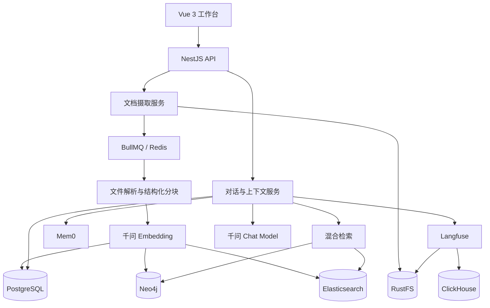
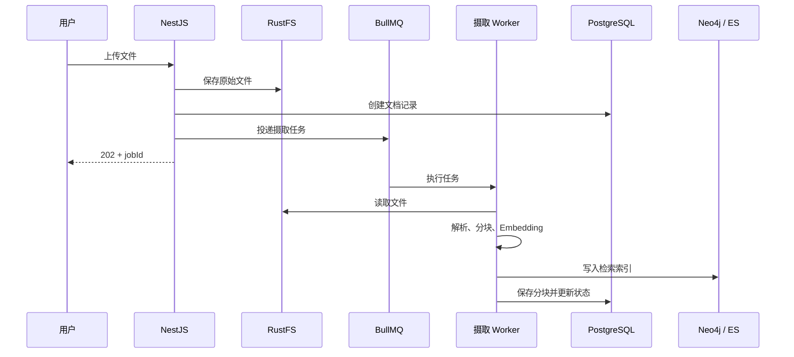
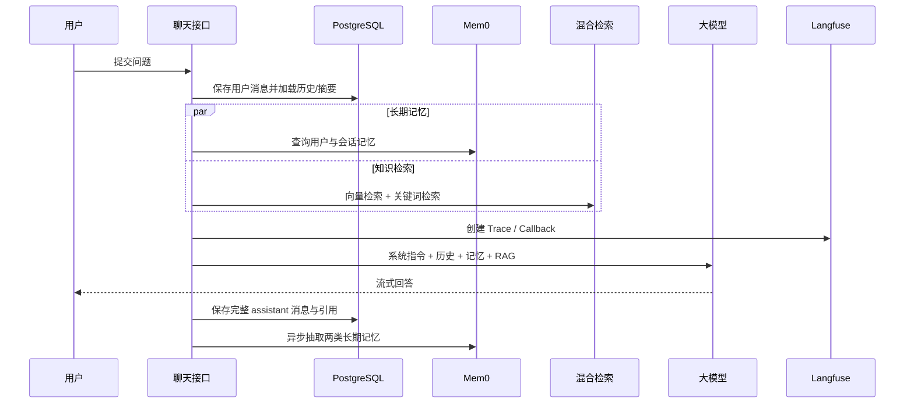

# 我用 AI 做了一个知识库问答系统，但真正困难的不是写代码

> 这是一次个人项目复盘，也是一份 AI 编程的工程实录。我在当前项目继续开发时，围绕 Vue 3、NestJS、PostgreSQL、Neo4j、Elasticsearch、Redis、RustFS、Mem0 和 Langfuse 处理了一连串真实问题。AI 写了大量代码，但真正消耗精力的部分，是不断追问：数据真的写进去了吗？不同存储一致吗？服务重启以后还成立吗？模型回答的依据可追踪吗？

> 取材说明：本文只依据当前仓库、提交记录，以及工作目录精确匹配当前项目的 Codex 会话；同名旧项目、其他目录和独立 worktree 的会话均不纳入项目历史。

## 1. 为什么会有 Knowledge Quiz 2

我继续做这个项目，不是因为市场上缺少一个知识库产品，也不是准备立刻把它包装成商业化 SaaS。更直接的原因是，我想用一个足够完整的个人项目，把 RAG、流式对话、文档处理、记忆系统和大模型可观测性真正串起来。

网上介绍 RAG 的文章很多。最小示例通常只有几步：读取文件、切分文本、生成 Embedding、向量检索，再把结果拼进 Prompt。这条链路很适合解释概念，但离一个能够持续使用的系统还有很远。

只要往前走一步，问题就会迅速变多：

- 原始文件放在哪里，数据库只存路径还是也存正文？
- PDF、Markdown、Excel 和视频应该采用同一种切分方式吗？
- 文档更新以后，关系数据库、向量库和全文索引怎样保持一致？
- 流式响应还没结束时，assistant 消息应该在什么时候持久化？
- Redis 里的会话记录过期后，页面刷新还能不能继续聊天？
- RAG 找到的片段到底来自哪一份文档，用户能不能下载原文核对？
- 模型调用变慢或回答异常时，怎样知道是检索、Prompt、模型还是基础设施的问题？

这些问题放在一起，才是我真正想练习的内容。

当前项目的产品边界并不复杂。前端只有两个主要工作区：一个 AI 会话页，一个文档管理页。会话页左侧是会话列表，右侧是一问一答的聊天区域；管理页负责上传文档、查看列表以及检查和编辑分块。它是个人实战项目，所以目前没有引入登录、租户、角色和复杂权限。

但实际技术栈一点也不小：NestJS、Vue 3、LangChain、Vercel AI SDK、PostgreSQL、Redis、RustFS、Elasticsearch、Neo4j、Mem0、Langfuse、ClickHouse，再用 Docker Compose 统一拉起。

现在回头看，这份清单既是一张学习路线，也是一颗复杂度炸弹。每多引入一个组件，就多一份配置、多一个故障面，也多一种数据一致性问题。不过这正是个人项目的价值：可以主动把问题放大，再从中理解每个组件的真实边界。

我还想额外验证一件事：AI 能不能真正参与一个中等复杂度的全栈项目，而不只是生成几个孤立函数。

答案是可以，但有一个非常重要的前提：**AI 可以承担大量实现工作，却不能替开发者定义什么叫“做完”。**

## 2. 我是怎样把当前项目一步步跑实的

我在当前项目里的 AI 协作记录，不是从创建仓库开始，而是从一条真实的上传错误开始。

2026 年 7 月 6 日，`POST /api/documents` 在写入 Neo4j 时失败。错误明确指出，节点属性不能保存嵌套 Map。修完这个问题后，我又发现文档列表里的 `chunkCount` 已经是 2，`GET /api/chunks` 却一条数据也查不到：向量数据写进去了，PostgreSQL 的分块表却没有同步落库。

第二天，聊天接口又把 assistant 消息保存成了 `[object AsyncGenerator]`。页面上的流式输出和数据库里的最终消息并不是同一件事，日志装饰器在包装异步生成器时改变了返回语义。

这些问题决定了当前项目的演进方式：不是从一张宏大蓝图顺序施工，而是从真实请求出发，一次次把断开的数据链路接起来。

随后几天的会话记录基本沿着这条路线推进：

1. 修复 RustFS 中文文件名经过 multipart、URL 编码和对象 Key 后不一致的问题。
2. 把自定义聊天 GET/SSE 协议改成 Vercel AI SDK 默认的 POST UI Message Stream。
3. 让会话标题、历史消息和 Langfuse Trace 真正工作。
4. 给语音播放增加暂停与继续，并排查 Langfuse 没有上报的问题。
5. 把 Langfuse 的对象存储统一到 RustFS，补齐文档引用和原文件下载。
6. 分析 Redis Key 来源，将业务 Redis 与 Langfuse 使用不同逻辑 DB 隔离。
7. 审查整个项目的数据一致性、生产部署、性能、日志和模块边界。
8. 将同步文档处理改成 BullMQ 后台摄取，并补齐迁移、校验和失败补偿。
9. 分析不同文件类型的 RAG 流程，处理扫描 PDF、向量索引和记忆系统问题。

这条历史比“AI 一次生成了整个系统”更有价值。它说明 AI 编程在真实项目里更常见的形态，是围绕日志、接口和运行状态持续迭代。

项目的核心问题也逐渐从“这个功能能不能调用”变成了“整条链路是否真的闭合”。

例如，一次文档上传只有同时满足下面这些条件，才算真正完成：

- 原始文件已经进入对象存储；
- PostgreSQL 中存在文档记录和状态；
- 后台任务能够读取文件并完成解析；
- 分块保留了页码、标题路径、Sheet、幻灯片等来源信息；
- Embedding 已经生成；
- PostgreSQL、Neo4j 和 Elasticsearch 中的数据相互对应；
- 失败时能够看到失败阶段，并清理部分写入的数据；
- 前端能查询处理进度，而不是让一次 HTTP 请求一直等待。

这套验收标准不是 AI 第一次生成代码时自动给出的，而是在多次真实运行、报错和返工以后逐渐形成的。

## 3. 技术选型：重点不是用了什么，而是谁负责什么

复杂项目很容易写成技术名词展览。真正重要的不是“用了多少组件”，而是每个组件为什么存在，以及谁是某类数据的事实源。

### 3.1 前端：一个尽量克制的工作台

前端采用 Vue 3、TypeScript、Vite 和 UnoCSS。组件使用 Composition API 与 `<script setup>`，HTTP 请求集中在 composable 中。

页面没有做成一个展示型首页，而是直接进入工作台：

- AI 会话页负责会话列表、流式消息、Markdown 展示、语音输入和语音播放；
- 文档管理页负责上传、搜索、处理状态、分块查看与编辑。

聊天部分使用 `@ai-sdk/vue`。它的价值不只是“接收 SSE”，而是约定了一套 UI Message 与流式事件协议，帮助前端管理正在生成的消息、错误状态和最终内容。

项目早期曾担心当前版本是否提供 `useChat`，也准备过自定义 SSE composable 作为兜底。后来实际安装版本确认可用，于是前后端围绕 AI SDK 的数据格式统一，而不是长期维护一套自定义协议。

目前项目没有复杂的前端路由体系，主页面切换由 `App.vue` 中的本地状态完成。对个人工具来说，这个选择足够直接。若以后增加鉴权、分享链接、文档独立详情页，再引入 Vue Router 更合理。技术选型并不是把所有“标准答案”一次装齐，而是让复杂度跟着需求增长。

### 3.2 后端：NestJS 负责组织边界

后端采用 NestJS 11 和 TypeScript。它最适合这个项目的地方，是模块、依赖注入、DTO、Pipe、Filter 和 Interceptor 能够把不同职责分开。

当前主要模块包括：

- `DocumentModule`：文档、分块和摄取任务；
- `ConversationModule`：会话与消息持久化；
- `AiModule`：模型、Embedding、检索和对话上下文；
- `MemoryModule`：用户记忆与会话记忆；
- 基础设施模块：Redis、Neo4j、Elasticsearch、RustFS、Mem0、Langfuse、文件处理和语音能力。

TypeORM 连接 PostgreSQL。模型调用通过 LangChain 的 OpenAI 兼容适配层接入千问，聊天模型、Embedding 和重排序分别承担不同任务。NestJS 控制器只负责 HTTP 契约，复杂流程尽量收口到 service，而不是把上传、解析、向量化和多库写入全塞进一个 controller。

流式聊天是一条跨层链路：后端从模型得到异步数据流，将其转换成 AI SDK UI Message Stream；前端持续消费增量；流结束后，后端再保存完整 assistant 消息和引用。任何一层把“流”误当成普通字符串，数据都会出问题。

### 3.3 数据与基础设施：先确定事实源

各组件目前的职责如下：

| 组件 | 主要职责 | 不应该承担的职责 |
| --- | --- | --- |
| PostgreSQL | 文档、分块、会话、原始消息、摘要等业务事实 | 不承担向量近邻搜索 |
| RustFS | 原始上传文件、可下载对象 | 不保存业务查询关系 |
| Neo4j | 文档分块向量和可扩展的图关系 | 不作为会话历史事实源 |
| Elasticsearch | 分块全文检索与关键词召回 | 不单独决定最终相关性 |
| Redis | BullMQ 队列、缓存及其他短生命周期状态 | 不再作为聊天上下文的唯一来源 |
| Mem0 | 跨会话用户记忆和会话语义记忆 | 不代替完整聊天记录 |
| Langfuse | LLM Trace、Generation、会话和性能观测 | 不参与业务事务 |
| ClickHouse | Langfuse 的分析数据 | 不直接承载本项目业务查询 |

这里最关键的调整发生在记忆系统：早期设计把 Redis 看成短期记忆，把 Mem0 看成长期记忆。这个说法听起来合理，但 Redis 的 TTL 会让上下文过期，Mem0 又只适合保存经过抽取的语义事实，二者都不适合成为完整会话的事实源。

因此当前的方向是：PostgreSQL 永久保存原始消息和滚动摘要；Redis 不再参与聊天上下文重建；Mem0 只做语义补充。

### 3.4 两条核心数据链路

先看整体结构：



文档链路已经从早期的同步 controller 改成后台任务：



Worker 会记录 `QUEUED`、`EXTRACTING`、`CHUNKING`、`EMBEDDING`、`INDEXING` 等阶段，限制页数、分块数和总 Token，并设置重试与失败清理。上传接口因此不必等待大文件处理完成，前端也能看到更准确的进度。

聊天链路则是另一种形态：



检索当前采用双路召回：Neo4j 向量搜索和 Elasticsearch 关键词搜索并行执行，各取候选结果，再通过 RRF 融合。融合后的候选交给千问 `gte-rerank-v2` 重排序，最后按阈值选择最多 8 个核心分块，并在 Token 预算内补充它们的相邻分块。

RRF 的思路很简单：不直接比较两种搜索引擎不可比的原始分数，而是按排名累加权重：

```text
score(document) = Σ 1 / (k + rank)
```

向量检索擅长“意思相近”，关键词检索擅长“字面命中”，重排序再根据问题和文本做一次更精细的判断。三层组合比只调一个相似度阈值稳定得多。

## 4. AI 是怎样参与这个项目的

如果只说“这个项目使用 AI 编程完成”，信息量其实很低。AI 在不同阶段扮演的角色完全不同。

### 4.1 从具体问题收敛成系统方案

当前项目中的多数对话都从一个具体问题开始：接口报错、数据查不到、服务启动慢、Trace 没有上报，或者现有记忆方案不符合预期。

AI 的第一层作用是沿着代码和运行状态定位问题；第二层作用是把局部故障还原成系统设计。例如：

- `chunkCount` 与分块列表不一致，背后是文档、Chunk 和向量节点的多存储一致性；
- Redis 过期导致上下文丢失，背后是会话事实源没有定义清楚；
- “整篇文档有多少标题”回答不出来，背后是 Top-K RAG 与全局聚合问题的能力差异；
- Langfuse 没有 Trace，背后涉及 Callback、环境变量、数据库、ClickHouse 和对象存储的整条观测链路。

我通常先让 AI 分析当前实现和备选方案，再根据项目规模确定边界。会话记忆 V2 就经历了这个过程：先明确 PostgreSQL、Redis、Mem0 各自职责，再确定 70% 摘要阈值、50% 压缩目标、乐观锁和失败语义，最后才进入跨模块实现。

### 4.2 执行跨文件修改并持续验证

当前项目不是由这批会话从空仓库创建的，因此我不能把项目骨架归功于这里的 AI 协作。能够由会话记录确认的，是 AI 在已有代码库上完成了大量横向修改：

- 同时调整 NestJS controller、service、entity 与 migration；
- 同步 Vue composable、组件和 TypeScript 类型；
- 修改 Compose、初始化脚本和数据库重置流程；
- 补充针对故障根因的测试；
- 运行构建、Lint、测试、容器状态与真实接口检查。

这类工作最适合 AI 的原因，是它需要在较大的代码范围内保持局部契约一致，又包含大量可通过工具快速验证的步骤。开发者仍然负责给出正确的目标、真实故障现场和风险边界。

### 4.3 根据真实日志定位问题

后续协作更多是围绕具体证据展开。我会把接口、错误堆栈、数据库现象或 Docker 输出直接交给 AI，例如：

- 文档列表显示 `chunkCount = 2`，分块接口却查不到数据；
- Neo4j 拒绝写入嵌套 Map 属性；
- assistant 内容被保存为 `[object AsyncGenerator]`；
- Langfuse 页面没有 Trace；
- PostgreSQL 被判定 unhealthy；
- `document_embeddings_v2` 向量索引不存在；
- Redis 中出现很多看不懂的 Key；
- 页面刷新后历史消息和记忆不完整。

具体日志会显著提高 AI 的定位质量。与其说“上传坏了”，不如提供请求、错误、预期结果和相关数据状态。AI 可以顺着调用链查 controller、service、entity、Compose 和前端 composable，再给出跨文件修改。

### 4.4 让 AI 反过来审查整个项目

当功能基本跑通后，我让 AI 从三个角度重新审查：不合理的结构、性能问题、扩展性问题。这次审查发现了很多“单个接口能跑，但系统长期会坏”的问题：

- 编辑或删除 Chunk 只更新 PostgreSQL，没有同步 Neo4j；
- 生产 Dockerfile、端口和前端 API 地址不一致；
- 生产环境关闭 `synchronize`，却缺少可靠 migration；
- 上传接口串行执行整个摄取流程，容易超时和产生内存峰值；
- 多存储写入失败后没有补偿；
- Neo4j 所谓批处理仍是一条 Chunk 一次网络请求；
- 日志可能输出 SQL 参数和消息正文；
- 前后端状态枚举与字段类型已经出现漂移。

这类代码审查是 AI 很有价值的用法。它不需要重新理解每个文件，可以在全仓库搜索后同时比较多条数据链路。但审查意见也不能照单全收，仍要按风险和项目规模选择实施顺序。

### 4.5 一次跨模块改造，而不只是改一个函数

项目中有一次集中整改，覆盖了异步摄取、跨库存储一致性、生产迁移、DTO 验证、Neo4j 批量写入、日志 Trace、数据库索引、前后端契约和测试。

从会话记录看，这次任务大约持续一个小时，最终后端 15 个测试套件、137 个测试全部通过，前后端构建和 ESLint 也通过。这个数字不能直接等同于“一小时完成了人工多少天的工作”，因为此前已经有项目基础，任务也消耗了大量模型 Token。但它确实说明，AI 能长时间执行“阅读、修改、编译、修错、补测试、再验证”的完整循环。

近期的会话记忆 V2 又是另一个例子。一次改造同时涉及：

- 会话与消息实体字段；
- TypeORM migration；
- 消息游标分页；
- Token 预算服务；
- 滚动摘要与乐观锁；
- Mem0 用户/会话双作用域；
- 前端向上加载历史消息；
- Langfuse 与日志观测字段。

人工当然也能逐项完成，但 AI 在横向同步类型、接口、模块依赖和测试方面优势明显。开发者要做的，是在执行前把数据语义和失败策略说清楚。

## 5. AI 编程过程中最值得记录的坑

### 5.1 一个接口成功，不代表整条数据链路成功

当前项目最早暴露的两个问题，已经足以说明这一点。

第一次，文档上传在 Neo4j 写入阶段失败，因为 metadata 中包含数据库不接受的嵌套 Map。第二次，上传请求看起来完成了，文档记录上的 `chunkCount` 也是 2，但 `chunks` 表根本没有对应记录。

这不是“功能有没有写”的问题，而是同一次业务操作在多个存储中的完成状态不同：对象可能已经进入 RustFS，文档记录可能已经进入 PostgreSQL，向量节点可能写入 Neo4j，Chunk 行却没有落库。

从这些故障以后，我判断一项功能是否完成，会继续检查：

- 数据分别写到了哪些存储？
- 每个存储使用的主键和来源元数据能否相互对应？
- 中间一步失败时，文档状态是否准确，已写入数据是否清理？
- 页面展示的计数来自真实查询还是某个流程变量？
- 服务重启或数据库重置以后，索引能否恢复？
- 测试是否覆盖了协议和多存储副作用？

AI 很容易针对当前报错给出局部修复。开发者要进一步追问的是：同一类断点是否还存在于编辑、删除、重试和恢复流程中。

### 5.2 流式输出不是普通字符串

项目曾出现过一条很直观的坏数据：

```text
assistant.content = "[object AsyncGenerator]"
```

根因是把模型返回的异步生成器直接传给了消息保存逻辑。JavaScript 在需要字符串时对对象做了隐式转换，于是数据库忠实地保存了 `[object AsyncGenerator]`。

这件事暴露了流式聊天中的三个不同阶段：

1. **生产流**：模型不断产生 token 或事件。
2. **传输流**：后端把事件编码成前端理解的协议。
3. **最终结果**：所有增量合并后，得到可持久化的完整回答。

前端需要前两个阶段来获得即时反馈，数据库需要第三个阶段来保存可恢复历史。不能因为它们都叫“消息”就使用同一个变量直接处理。

更隐蔽的问题是，这类错误很难通过静态界面发现。用户当时可能已经看到了正常流式回答，只有刷新会话或直接查数据库时，才会发现历史内容坏了。因此测试不仅要断言流能够发送，还要消费完整异步迭代器并检查最终持久化结果。

### 5.3 多数据库让一个 CRUD 变成一致性问题

在单数据库应用里，编辑一条 Chunk 通常是一条 `UPDATE`。在这个项目里，同一个 Chunk 至少有几种表示：

- PostgreSQL 中的正文、元数据和 token 数；
- Neo4j 中的文本、向量和检索元数据；
- Elasticsearch 中的全文索引；
- Document 上汇总的 `chunkCount`；
- Langfuse Trace 中曾经使用过的引用快照。

早期的 Chunk 编辑只修改 PostgreSQL，RAG 仍可能从 Neo4j 召回旧内容；删除 Chunk 后，向量节点和文档计数也可能不变。对用户来说，后台明明已经删掉一段内容，AI 却继续引用它，这是比接口报错更危险的错误。

后来 Chunk 操作被收口到一个一致性服务中：编辑时重新计算可检索文本和 Embedding，再同步外部索引；删除时清理向量节点并更新计数。文档摄取失败时也尝试清理已写入的 Chunk 和索引。

这里不能幻想一个覆盖 PostgreSQL、Neo4j、Elasticsearch 和 RustFS 的全局 ACID 事务。更现实的方案是：

- 明确一个主状态机；
- 为每个阶段记录状态；
- 使用幂等 jobId 避免重复任务；
- 失败时执行补偿清理；
- 对补偿失败进行日志和人工可见告警；
- 定期提供重建或校验工具。

项目还遇到过 Neo4j 属性类型问题。Neo4j 节点属性只能是基础类型或基础类型数组，不能直接保存嵌套 Map。原本把整个 metadata 对象作为属性写入，会得到类似下面的错误：

```text
Property values can only be of primitive types or arrays thereof.
Encountered: Map{totalChunks -> ..., documentId -> ..., chunkIndex -> ...}
```

修复方法不是把对象粗暴 `JSON.stringify` 后结束，而是先确定哪些字段需要参与查询，把 `documentId`、`chunkId`、`chunkIndex`、`documentName` 等提升为顶层基础属性；搜索结果再重建应用侧 metadata。数据模型必须服务于数据库能力，而不是把 JavaScript 对象原样塞进所有存储。

### 5.4 RAG 能回答局部问题，不代表能回答全局问题

我曾上传一份课程 Markdown，然后问：“这篇文档一共有多少个标题？”

普通 Top-K RAG 很难稳定回答这个问题。它只会找与问题最相似的几个分块，而“标题总数”需要遍历整篇文档或读取预先计算的结构化统计。即使每个分块里都保留标题，Top-K 也不会把所有标题都召回。

这是 RAG 很典型的能力边界：

- “某一章如何解释并发控制”是局部语义检索；
- “全文有多少章”是全局聚合；
- “第三章和第五章观点有什么冲突”是跨区域比较；
- “按原文顺序总结整篇文档”需要层级摘要或 Map-Reduce。

仅靠增加 Top-K 并不能从根本上解决问题，反而会扩大上下文、增加噪声和成本。更合理的方向包括：

- 摄取阶段保留 Markdown 标题路径、PDF 页码、Excel Sheet 与行范围；
- 为文档生成结构树和文档级摘要；
- 区分检索型问题与聚合型问题；
- 对全局问题执行限定文档内的扫描、SQL 聚合或 Map-Reduce；
- 使用父子分块，让检索命中细粒度子块后返回更完整的父上下文。

当前项目已经保留页码、标题路径、Sheet、行范围、幻灯片编号和音视频时间段等来源信息，并支持相邻分块扩展，但“问题路由 + 文档级结构索引”仍是后续需要继续完善的方向。

### 5.5 向量索引不是写完代码就永久存在

聊天接口曾经直接报错：

```text
There is no such vector schema index: document_embeddings_v2
```

代码引用了 `document_embeddings_v2`，Neo4j 实例里却没有这个索引。可能原因很多：数据库被重置、索引名称升级、初始化没有执行、旧索引仍使用另一个标签，或者应用在索引进入 ONLINE 前就开始查询。

修复不仅是手动执行一次 `CREATE VECTOR INDEX`。当前 Neo4j 服务会：

- 启动时检查索引；
- 创建缺失索引并等待 ONLINE；
- 搜索遇到缺失索引时尝试重建并重试一次；
- 识别 schema 相同的旧索引，避免重复创建；
- 通过测试固定标签、属性和向量维度。

向量模型和索引是一个契约。Embedding 维度变了，索引配置和历史数据都必须重建；节点标签或属性名变了，查询也要同步。它们应该进入 migration、自检和运维工具，而不能只存在于某个开发者的本地数据库里。

### 5.6 Docker Compose 能启动，不代表系统真正可用

这个项目的大量时间并没有花在业务代码上，而是花在 Docker Compose。

遇到过的问题包括：

- PostgreSQL 首次初始化 SQL 使用了不支持的语法；
- Windows 绑定卷初始化较慢，健康检查窗口太短；
- Langfuse 在 PostgreSQL 可连接前就执行 migration；
- ClickHouse migration 与依赖健康状态互相影响；
- Langfuse 与业务服务错误地共享或指向同一个数据库；
- RustFS 已经替代 MinIO，但配置和初始化脚本仍残留 `minio`、`mc`；
- Docker Hub 镜像标签不存在或拉取时 TLS 超时；
- Langfuse 端口已监听，但内部初始化尚未完成；
- 清空 Langfuse 数据后，Web 与 Worker 必须重启才能恢复默认数据。

其中一次修复把对象存储初始化统一为 `rustfs-init` 一次性容器，创建 `documents` 和 `langfuse` 两个私有桶，并移除残留的 MinIO 客户端。数据库重置脚本也不再只以命令退出码为成功标准，而会重启 Langfuse 并等待页面连续多次返回成功。

这让我把“服务启动成功”拆成了几个层次：

1. 容器进程还活着；
2. Docker 健康检查通过；
3. 端口可以连接；
4. HTTP 返回成功；
5. migration 与初始化完成；
6. 业务接口能够完成一次真实读写。

只验证 `docker compose up -d` 的退出码，最多证明 Compose 接受了这份配置。它不能证明系统可以使用。

### 5.7 “Redis 短期记忆 + Mem0 长期记忆”并不完整

早期记忆模型很直观：Redis 保存最近会话，TTL 为一小时；Mem0 保存用户长期记忆。

实际使用后，几个问题很快出现：

- Redis 到期后，模型上下文丢失；
- 页面刷新需要从 PostgreSQL 恢复消息，但模型和 UI 读取来源不一致；
- Mem0 只有用户作用域，没有会话作用域；
- 长对话没有摘要，最终一定会超过模型上下文；
- 把所有历史拼成一段普通文本，会丢失 user/assistant 的角色结构；
- 并发请求可能同时更新摘要，后写入的旧版本覆盖新版本。

正在收尾的会话记忆 V2 重新定义了三层数据：

```text
PostgreSQL：完整原始消息 + 连续滚动摘要，唯一事实源
Mem0 user_id：跨会话稳定偏好、身份和长期目标
Mem0 run_id：当前会话的重要事实、决定和未解决事项
```

模型上下文的组成顺序也变得明确：

```text
系统指令
+ PostgreSQL 滚动摘要
+ 未摘要的近期原始消息
+ Mem0 用户记忆
+ Mem0 会话记忆
+ RAG 检索内容
+ 当前问题
+ 输出 Token 预留
```

系统会估算这些内容的总 Token。默认在安全上下文占用超过 70% 时同步生成新摘要，把旧摘要与最早一批未摘要完整轮次合并，并至少保留最近 8 条原始消息；压缩目标是不超过 50%。原始消息不会因为摘要而删除。

摘要保存使用 `summaryVersion` 乐观锁。若两个请求同时压缩上下文，只有版本匹配的更新能够成功，冲突方重新读取并计算一次。

Mem0 查询与保存采用不同失败语义：回答前的记忆查询失败会中止请求，避免悄悄生成缺少关键上下文的答案；回答后的记忆保存失败会进行有限次数退避重试，最终失败只记录日志，不影响已经完成并写入 PostgreSQL 的回答。

这套方案已经完成代码实现和本地验证：后端 18 个测试套件、142 个测试通过，前后端类型、构建和 ESLint 校验通过。不过它仍是当前工作区中的未提交改动，migration 也没有由本次会话直接连接数据库执行。因此本文把它写成“已实现并验证、尚待合入”的演进，而不是已经稳定发布的能力。

### 5.8 写技术文章也要像审查代码一样核对事实

仓库里已经有一篇较早的掘金稿。它对功能和架构的描述很完整，但文章中的能力需要重新与当前代码核对。例如，多模态处理、双路检索、长期记忆和生产能力都经历过多轮修改，不能只凭一份旧文档判断现状。

模型很擅长补全一个“合理的完整故事”。当项目里出现 Neo4j、Elasticsearch 和 Rerank，它很容易把它们组织成一条完整的混合检索链路；当代码中出现图片、音频、视频类型，它也容易把支持的文件扩展名等同于已经稳定的多模态理解能力。

因此写这篇文章时，我重新核对了仓库、提交记录和项目聊天：

- 已经存在于当前代码中的能力，用现在时；
- 历史上出现过并已修复的问题，用过去时；
- 当前未提交或仍在验证的改造，明确写“正在进行”；
- 只有方向、没有实现证据的内容，放到后续计划。

文档和代码一样需要验收。更重要的是，取材时还必须严格限制会话目录，不能因为项目名相似就把旧项目的经历拼进当前项目。否则一篇看起来很专业的技术文章，也可能建立在错误的历史上。

## 6. AI 到底给这个项目提了多少效率

我不准备给出“效率提升 10 倍”之类的数字，因为这个项目没有建立人工对照组，也没有统一计算需求分析、等待 Docker、模型 Token 成本和返工时间。

但有几类效率提升是非常明确的。

### 6.1 横向修改的速度

会话记忆 V2 同时修改实体、migration、service、controller、Mem0 适配层、前端 composable、消息列表和类型定义。传统手工开发最容易漏掉的是契约同步：后端新增分页游标，前端类型忘记更新；实体增加字段，migration 漏掉索引；删除会话时，Mem0 会话记忆没有一起清理。

AI 能快速搜索所有消费者，再批量完成这些机械但要求上下文一致的工作。

### 6.2 从错误堆栈回溯调用链

当 Neo4j、Langfuse 或 BullMQ 报错时，问题往往跨越 Compose、环境变量、初始化代码和业务 service。AI 可以快速检索变量名、端口、索引名和调用位置，减少人工在几十个文件间跳转的时间。

### 6.3 补测试和执行回归

AI 不只生成测试模板，也能根据修复目标增加针对性用例，例如：

- 异步生成器仍能被消费；
- Neo4j metadata 被转成基础属性；
- 缺失向量索引时自动创建并重试；
- 编辑 Chunk 会重新计算并同步检索内容；
- 中文文件名经过 RustFS 上传下载仍保持正确；
- 视频处理缺少 FFmpeg 时明确失败，而不是索引占位文本。

更重要的是，它可以持续运行构建、测试、Lint、Compose 校验和接口探测，再根据错误继续修复。一次集中整改后，项目达到了 15 个后端测试套件、137 个测试通过；另一次基础设施改造也完成了数据库重置、Docker 重启、Langfuse、后端 API 和前端构建的联合验证。

### 6.4 AI 与人工的职责并不对称

| 工作 | AI 的优势 | 人的职责 |
| --- | --- | --- |
| 方案展开 | 快速列出模块、数据流和风险 | 决定哪些问题值得解决 |
| 工程骨架 | 批量创建配置、模块和接口 | 判断它是骨架还是完成品 |
| 跨文件修改 | 搜索消费者并同步类型 | 定义数据语义和兼容边界 |
| 故障定位 | 顺着日志快速查调用链 | 提供真实现场并确认根因 |
| 测试 | 快速补齐大量场景并回归 | 判断测试是否覆盖真实风险 |
| 架构审查 | 同时扫描一致性、性能和安全问题 | 做优先级与成本取舍 |
| 基础设施 | 修改 Compose、脚本和健康检查 | 管理真实数据、密钥与破坏性操作 |
| 产品验收 | 按给定条件执行检查 | 定义“正确”和“可接受” |

AI 提升的主要是实现吞吐量。需求判断、取舍和验收不但没有消失，反而因为代码产出更快而变得更重要。

## 7. 哪些部分必须由我接入和把关

### 7.1 决定项目真正要解决的问题

当前项目已经包含 Mem0、Neo4j、Elasticsearch、Langfuse 等许多组件。AI 可以继续为每个组件扩展能力，但这不代表项目应该无限增长。

开发者必须决定：当前目标是把文档问答做可靠，还是扩展成更通用的平台？图关系需要做到什么程度？没有登录系统时，用户隔离做到什么程度？多模态是核心能力，还是先把文本 RAG 做可靠？

如果这些问题没有答案，技术栈会反过来支配产品。

### 7.2 质疑“看起来合理”的实现

当前项目里的错误大多不是一眼可见的语法问题：文档计数正确但 Chunk 没落库、页面流式输出正常但历史消息保存错误、业务 Redis 可用但和 Langfuse 的 Key 混在一起、容器端口已监听但初始化尚未完成。只有继续追问数据落点、隔离边界和重启行为，才能发现这些问题。

AI 给出的局部修复通常是合理的。人的价值在于检查局部合理的代码组合起来是否仍然正确。

### 7.3 提供真实运行现场

很多问题无法靠静态代码推断：Windows 文件权限、Volta 路径、Docker Desktop 状态、旧容器卷、端口占用、云端 API Key、Langfuse 首次注册流程，都依赖真实环境。

我需要运行项目、观察页面、发起请求，再把准确日志交给 AI。AI 可以控制和检查环境，但真实账号授权、密钥配置、付费服务和可能破坏数据的操作必须由我掌握。

### 7.4 定义业务语义

“长期记忆”不是一个技术组件名称。哪些信息应该跨会话保留？会话中的临时决定是否应该进入用户画像？删除会话时是否删除对应语义记忆？记忆服务不可用时应降级回答还是直接失败？

同样，“回答正确”也不是接口返回 200。对于 RAG，要判断引用是否真的支持结论；对于全局问题，要判断当前检索策略是否在能力范围内。这些都需要产品和领域语义。

### 7.5 决定风险和复杂度

Mem0 保存失败可以用 Outbox 和消息队列做可靠补偿，也可以只在进程内重试几次后接受丢失。个人项目当前选择后者，因为 PostgreSQL 中的原始消息仍然可靠，增加一套 Outbox 会显著扩大实现和运维成本。

这种取舍没有唯一正确答案。AI 可以分析方案，却不知道我愿意承担多少复杂度。

### 7.6 做最终验收

AI 经常会报告“构建通过”“测试通过”，但我仍然需要关心：

- 测试命令是否会自动修改文件？
- Docker 镜像构建失败是代码问题还是网络问题？
- HTTP 200 是否发生在服务真正初始化完成之后？
- 工作区中是否混有尚未提交的其他改动？
- 测试数量增加，是否只是增加了大量低价值 mock？

项目所有权最终属于开发者。AI 可以执行验收步骤，但不能替我接受风险。

## 8. 我逐渐形成的一套 AI 协作方法

经过这个项目，我现在更倾向于用下面的方式与 AI 协作。

### 8.1 大任务先分析，再实现

对于记忆系统、检索链路和多存储一致性，我会先让 AI 阅读当前代码并给出方案。方案要说明事实源、数据流、失败策略、兼容性和验收条件。确认以后再实施。

这样做不是为了增加一份形式化文档，而是避免 AI 在写到一半时才替我决定关键语义。

### 8.2 用证据描述 Bug

一个有效的故障任务通常包含：

```text
操作：调用 POST /api/conversations/chat
现象：Neo4j 报 document_embeddings_v2 不存在
预期：数据库重置后应用仍能自动恢复检索能力
约束：不能只在本地手工建索引，需要补测试并验证项目启动
```

接口、日志、数据状态和验收标准越具体，AI 越不容易只修表面症状。

### 8.3 不用单元测试代替真实链路验证

测试可以使用 mock 隔离外部依赖，但 mock 通过不能证明 PostgreSQL、Neo4j、RustFS、Langfuse 和前端协议已经协同工作。任务中应同时要求针对性单元测试与真实运行验证；如果外部服务无法验证，要清楚报告限制。

视频处理就是一个例子：缺少 FFmpeg 时，明确失败比索引一段“视频内容待处理”的占位文本更可靠。向量索引也是一样：测试中的 driver mock 能返回结果，并不代表重置后的 Neo4j 实例真的存在 ONLINE 索引。

### 8.4 把验收条件写进需求

“修改完成”过于模糊。更好的要求是：

- 后端构建通过；
- 相关测试与全量测试通过；
- 前端类型检查和生产构建通过；
- Compose 配置可以展开；
- 关键容器健康；
- 真实接口返回预期状态；
- 数据库、对象存储和检索索引出现对应数据；
- 不输出或提交真实密钥。

验收条件会反向影响实现质量。AI 知道最后要检查真实数据，就不容易停在接口外壳。

### 8.5 按数据链路拆任务，而不是按文件拆

“修改 controller、service、entity”只是文件列表，不能表达目标。更合理的拆法是：

- 上传请求到后台摄取完成；
- Chunk 编辑到所有检索存储同步；
- 用户提问到流式回答和最终持久化；
- 页面刷新到历史消息恢复；
- 数据库重置到所有服务重新可用。

数据链路天然包含接口、状态、失败和验收，比文件列表更不容易遗漏。

### 8.6 保留人工检查点

数据库清理、Docker 卷删除、migration、密钥和云服务调用都可能造成不可逆影响。即使 AI 有能力执行，也应该明确目标路径、备份需求和允许的范围。

对于普通代码修改，AI 可以自主完成；对于破坏性操作，开发者必须保持知情和控制。

### 8.7 让 AI 做第二遍审查

功能实现后，再用一个不同视角要求 AI 审查：

- 数据一致性是否成立？
- 并发时会不会覆盖？
- 服务重启以后如何恢复？
- 日志是否泄露消息和 Embedding？
- 大文件和长会话会发生什么？
- 前后端契约是否漂移？
- 生产环境和开发环境是否使用了不同假设？

第一遍生成代码的 AI 优先完成任务，第二遍审查的 AI 才更容易站在破坏者和维护者视角发现问题。

## 9. 当前状态与仍然存在的问题

截至写作时，项目已经具备一条真实可运行的主链路：

- 上传文件到 RustFS；
- 通过 BullMQ 后台摄取；
- 解析 PDF、Markdown、DOCX、PPTX、TXT、JSON、URL 等内容，并保留结构元数据；
- 生成 Embedding，将分块同步到 PostgreSQL、Neo4j 和 Elasticsearch；
- 使用向量检索、关键词检索、RRF、云端重排序和相邻分块扩展构建 RAG 上下文；
- 通过 AI SDK 协议向 Vue 前端流式输出；
- 保存会话、消息、引用和原始文件下载信息；
- 使用 Langfuse 跟踪模型调用；
- 使用 Docker Compose 拉起本地基础设施；
- 提供多数据库重置和恢复检查。

会话记忆 V2 已完成代码实现和本地验证，但当前仍是未提交改动；migration 尚未在本文写作过程中直接连接数据库执行，因此还不能等同于已经发布的稳定能力。

项目也远没有“完成”。接下来最值得继续投入的方向包括：

### 9.1 更可靠的摄取补偿

当前后台任务已经支持重试和失败清理，但跨 PostgreSQL、Neo4j、Elasticsearch 与 RustFS 的补偿仍不可能绝对可靠。需要增加一致性巡检、孤儿对象清理和按文档重建索引工具。

### 9.2 结构化与父子分块

不同文件类型需要更精细的结构策略。Markdown 应保留标题树，PDF 应识别页和章节，Excel 应保留 Sheet 与表头关系。父子分块和文档级摘要可以提高跨段落问题与全局问题的表现。

### 9.3 RAG 评测体系

目前主要依赖人工提问和日志观察。后续需要建立包含局部事实、关键词、跨段比较、全局统计和无答案问题的评测集，记录召回率、引用准确性、回答忠实度、延迟和 Token 成本。没有评测集，调整 Top-K、阈值和 Rerank 只是在凭感觉优化。

### 9.4 自动生成前后端契约

项目曾出现状态大小写、分页字段和 Chunk 类型不一致。后续应从 OpenAPI 生成前端类型和客户端，减少手写重复契约。

### 9.5 生产能力

个人项目暂时没有登录和租户隔离。真正上线还需要鉴权、权限、配额、限流、上传安全检查、审计、备份、灰度 migration、监控告警和灾难恢复。

### 9.6 成本与敏感信息治理

Embedding、Rerank、聊天、ASR 和视觉模型都会产生费用。日志和 Langfuse Trace 又可能包含原文、问题与回答。需要明确采样、脱敏、保留周期、调用预算和失败降级策略。

保留这些“不完美”很重要。这个项目的意义不是证明我和 AI 一次就设计对了所有东西，而是展示一个系统如何在真实问题推动下演进。

## 10. 结语：AI 降低了实现成本，但提高了判断的重要性

这个项目最大的收获，不只是学会了怎样把 NestJS、Vue 3、Neo4j、Elasticsearch、Mem0 和 Langfuse 连接起来。

更重要的是，我开始理解 AI 编程改变了工程工作的哪一部分。

过去，一个个人开发者很难在短时间内同时维护前端、后端、数据库迁移、消息流、向量检索、对象存储、Docker Compose、日志和上百个测试。AI 把大量实现和检索成本降了下来，让一个人能够触及过去需要多人协作的工作量。

但代码越容易产生，“什么才算做完”就越重要。

一个 controller 存在，不代表请求链路成立；一个容器 Healthy，不代表业务完成初始化；一组测试通过，不代表它验证了真实风险；一个 RAG 回答语气确定，不代表引用足以支持结论；一篇技术文章结构完整，也不代表描述与代码一致。

AI 最擅长的是把明确的问题迅速展开成实现，并在反馈循环里持续修正。开发者最重要的工作，则是定义问题、识别假完成、决定取舍、提供真实证据，并对最终结果负责。

所以，如果要用一句话总结这次项目经历，我会这样说：

> AI 可以成为一个高产、耐心、覆盖面很广的工程搭档，但它不能替你拥有这个项目。
