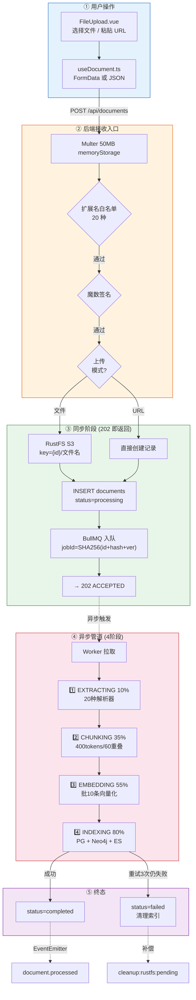
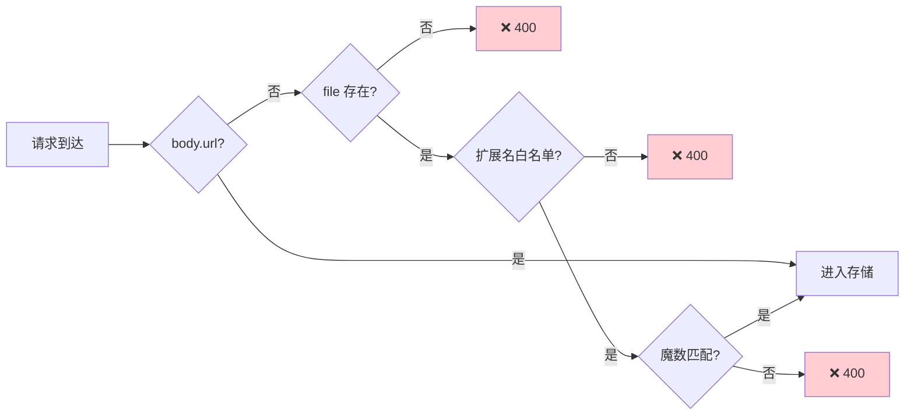
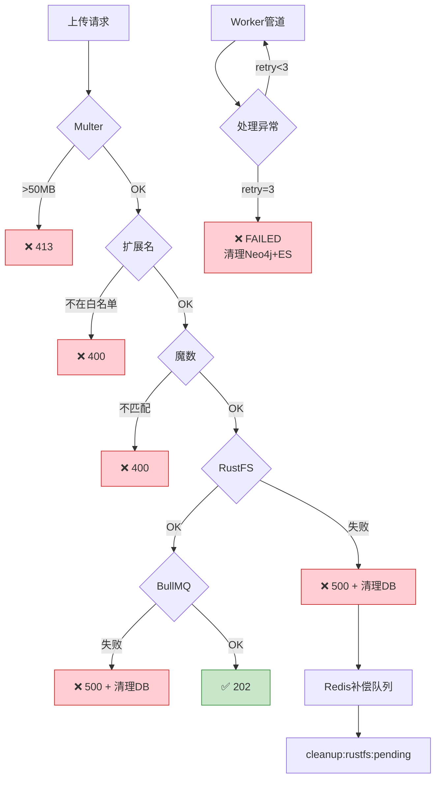

# 文件上传完整链路

> knowledge-quiz2 · 2026-07-14

---

## 1. 一图看懂全链路



---

## 2. 分阶段链路

### 阶段一：用户触发上传

**入口** → `frontend/src/pages/BackendManagementPage.vue`

```
DocumentList.vue ─「上传文件」按钮 ─→ activeTab = 'upload' ─→ 渲染 FileUpload.vue
```

> 两处入口：DocumentList 空状态提示 + 顶部操作栏，均切换到 upload Tab。

**组件关系** → 单向数据流（Props down, Emits up）

| 文件 | 角色 | 关键输出 |
|------|------|----------|
| `FileUpload.vue` | UI 层 | `emit('uploadFile')` / `emit('uploadUrl')` |
| `BackendManagementPage.vue` | 编排层 | 桥接 emit → composable 方法 |
| `useDocument.ts` | 逻辑层 | `handleFileUpload()` / `handleUrlUpload()` |
| `http.ts` | 传输层 | `axios.post('/api/documents', ...)` |

**两种上传路径**：

```
路径A: 本地文件
  用户选择文件 → setUploadFile(File) → 点"上传文件" → handleFileUpload()
  → FormData { file: File }  → POST multipart/form-data

路径B: URL
  用户输入URL → setUrlInput(value) → 点"处理URL" → handleUrlUpload()
  → JSON { url: string }    → POST application/json
```

**核心调用** (`useDocument.ts`):

```ts
// 路径A
const formData = new FormData();
formData.append('file', uploadFile.value);
const res = await http.post<UploadResponse>('/api/documents', formData, {
  headers: { 'Content-Type': 'multipart/form-data' },
});

// 路径B
const res = await http.post<UploadResponse>('/api/documents', {
  url: urlInput.value.trim(),
});
```

---

### 阶段二：后端接收与校验（同步，~200ms）

**路由** → `backend/src/documents/document.controller.ts`

```
POST /api/documents
  │
  ├─ ValidationPipe        → DTO 校验（url 需含协议头）
  ├─ FileInterceptor       → Multer 50MB / 单文件 / memoryStorage
  ├─ 文件名解码            → latin1 → utf8
  ├─ 扩展名白名单          → 20 种，不在名单 → 400
  ├─ 魔数签名              → 读取 buffer 头字节，不匹配 → 400
  └─ 进入上传逻辑
```

**闸门流程**：

```ts
// document.controller.ts — uploadFile()
// ┌─────────────────────────────────────────────┐
// │ 步骤                                         │
// │ 1. body.url 存在? → URL 模式, 跳到步骤5     │
// │ 2. !file         → 400 "请提供文件或URL"     │
// │ 3. 解码 + 扩展名 + 魔数 → 任一失败即 400    │
// │ 4. RustFS 上传   → 失败则 500 + 清理记录    │
// │ 5. INSERT 文档记录 → status=processing      │
// │ 6. enqueue()     → 失败则 500 + 清理记录    │
// │ 7. return 202 { documentId, jobId, status } │
// └─────────────────────────────────────────────┘
```

**校验决策树**：



---

### 阶段三：存储落盘（同步，~100ms）

```
Memory Buffer                       RustFS S3
┌──────────┐      PutObject         ┌──────────────────┐
│ file     │ ─────────────────────→ │ bucket: documents │
│ .buffer  │                        │ key: {id}/文件名   │
└──────────┘                        └──────────────────┘
     │                                      │
     │                                返回 URL → documents.path
     │
     └──→ BullMQ Job Data (buffer 直传)
           Worker 无需二次下载
```

**存储路径规则**：`{uuid}/{原始文件名}` → 例: `abc123-def/测试文档.pdf`

**BullMQ Job Data 携带字段**：

```ts
{
  jobId: SHA256(docId + contentHash + parserVersion),  // 幂等键
  data: { documentId, filePath, fileName, fileType },
}
// buffer 自身作为 job data 传入 — Worker 直接消费,不走 S3 回源
```

---

### 阶段四：异步管道（后台，~10s–300s）

**Worker 入口** → `backend/src/documents/document-ingestion.service.ts`

```
Worker.process(async (job) => {
  ┌────────────────────────────────────────────────────────┐
  │ 0. cleanupDocument(id)         清理旧 Neo4j + ES 索引  │
  ├────────────────────────────────────────────────────────┤
  │ 1. EXTRACTING (10%)            20种解析器按类型分发    │
  │    PDF → PDFLoader / OCR        DOCX → DocxLoader      │
  │    XLSX → xlsx 逐Sheet          PPTX → PPTXLoader       │
  │    TXT/MD/JSON → 文本解析       IMAGE → AI视觉描述     │
  │    AUDIO → 语音转文字           VIDEO → FFmpeg+AI      │
  │    URL → cheerio + SSRF防护     旧版Office → LibreOffice│
  ├────────────────────────────────────────────────────────┤
  │ 2. CHUNKING (35%)              cl100k_base tokenizer   │
  │    400 tokens 窗口 / 60 tokens 重叠                    │
  ├────────────────────────────────────────────────────────┤
  │ 3. EMBEDDING (55%)             10条/批 → AI向量化      │
  │    维度校验: EMBEDDING_DIMENSIONS                      │
  ├────────────────────────────────────────────────────────┤
  │ 4. INDEXING (80%)              多引擎同步写入          │
  │    PostgreSQL ─→ chunks 表      (全文检索 trigram)     │
  │    Neo4j      ─→ 图节点+关系    (向量检索)             │
  │    ES         ─→ 文档索引       (关键词检索)           │
  ├────────────────────────────────────────────────────────┤
  │ ✅ COMPLETE                     status=completed       │
  │                                processingStage=processed│
  └────────────────────────────────────────────────────────┘
})
```

**处理中状态实时更新** — 每个阶段推进时写 `processingStage`，前端轮询可见：

```
queued → extracting → chunking → embedding → indexing → processed
  0%        10%          35%         55%         80%       100%
```

---

### 阶段五：结果回传

```
┌─ 成功路径 ───────────────────────────────────────┐
│ Worker → status=completed                        │
│        → EventEmitter.emit('document.processed') │
│ 前端 GET /api/documents → DocumentList 刷新      │
│ 状态标签: 🟢 "已完成"                            │
└──────────────────────────────────────────────────┘

┌─ 失败路径 ───────────────────────────────────────┐
│ Worker 重试 3 次 (指数退避: 2s→4s→8s)           │
│ 3 次全失败 → status=failed                       │
│            → errorCode='INGESTION_FAILED'         │
│            → 清理: Neo4j节点 + ES文档             │
│ 前端 GET /api/documents → DocumentList 刷新      │
│ 状态标签: 🔴 "失败"                              │
└──────────────────────────────────────────────────┘
```

**即时响应 vs 异步状态**：

| 时机 | 前端动作 | 数据来源 |
|------|----------|----------|
| 上传提交后 | `alert("文件已提交，正在后台处理")` | POST 202 响应 |
| 列表刷新后 | 状态标签颜色变化 | GET /api/documents 的 `status` 字段 |
| 对话引用中 | 提供下载链接 | GET /api/documents 的 `path` 字段 (RustFS URL) |

---

## 3. 异常分支总览



**按阶段异常速查**：

| 阶段 | 异常场景 | 结果 | 兜底 |
|------|----------|------|------|
| Multer | >50MB | 413 | — |
| Multer | 字段名错误 | 400 | — |
| 扩展名 | 不支持的类型 | 400 | — |
| 魔数 | 伪造扩展名 | 400 | — |
| DTO | URL无协议 | 400 | — |
| RustFS | S3不可用 | 500 | 清理已创建DB记录 |
| BullMQ | Redis不可用 | 500 | 清理已创建DB记录 |
| 管道 | 任何异常 | 重试3次 | 清索引+标记failed |
| 删除文档 | RustFS删除失败 | — | 推入 `cleanup:rustfs:pending` |

---

## 4. 关键决策点

| 决策点 | 决策 | 位置 |
|--------|------|------|
| **同步 vs 异步** | 异步 — 202 立即返回，Worker 后台处理 | `@HttpCode(202)` |
| **内存 vs 临时文件** | 内存 — `memoryStorage`，buffer 直传队列 | `FileInterceptor` |
| **扩展名 vs 魔数** | 双重校验 — 先白名单后二进制签名 | `validateFileSignature()` |
| **本地 vs 对象存储** | RustFS S3 — 兼容 S3 API | `rustfs.service.ts` |
| **单队列 vs 多队列** | 单一 BullMQ 队列，4 阶段串行 | `document-ingestion.service.ts` |
| **轮询 vs 推送** | 当前轮询 `GET /api/documents` | `useDocument.ts` |
| **幂等策略** | jobId = SHA256(id+hash+version) | `enqueue()` |

---

## 5. 文件地图

```
前端                                  后端
─────────────────────────           ─────────────────────────────
FileUpload.vue          ─┐          document.controller.ts      ← 路由+验证
  ├ 文件选择              │          upload-document.dto.ts     ← DTO
  ├ URL 输入              │          document.service.ts        ← CRUD
  └ 进度条(模拟)          │          document-ingestion.service ← 队列+管道
                          │          chunk.service.ts           ← 分块+索引
BackendManagementPage    ─┤
  └ 编排层(emits→方法)    │          file-processor.service     ← 20种解析器
                          │          rustfs.service.ts          ← S3 存储
useDocument.ts           ─┤
  ├ handleFileUpload()    │          document.entity.ts         ← ORM
  ├ handleUrlUpload()     │          chunk.entity.ts            ← ORM
  └ 状态(ref)             │
                          │          http-exception.filter.ts   ← 异常格式化
http.ts                  ─┘          all-exceptions.filter.ts   ← 全局兜底
  └ axios instance
                                     main.ts                    ← ValidationPipe
types/index.ts
  └ UploadResponse
```

---

## 6. 已知缺陷

| # | 位置 | 问题 | 影响 |
|---|------|------|------|
| 1 | FileUpload.vue | 进度条固定50%（无 `onUploadProgress`） | 用户无真实进度感知 |
| 2 | FileUpload.vue | 拖拽文案有但无事件绑定 | 功能缺失 |
| 3 | BackendManagementPage | 两个 `id="file-upload"` 的 input | 可能触发无accept限制的input |
| 4 | useDocument.ts | `alert('失败')` 未展示API具体错误 | 用户不知失败原因 |
| 5 | http.ts | 超时30s，大文件可能不足 | 大文件上传截断 |
| 6 | useDocument.ts | 无前端50MB预校验 | 上传后才被后端拒绝 |
| 7 | 全局 | 状态依赖轮询无推送 | 延迟感知 |
| 8 | 管道 | buffer 全量在内存 | 大文件内存压力 |
